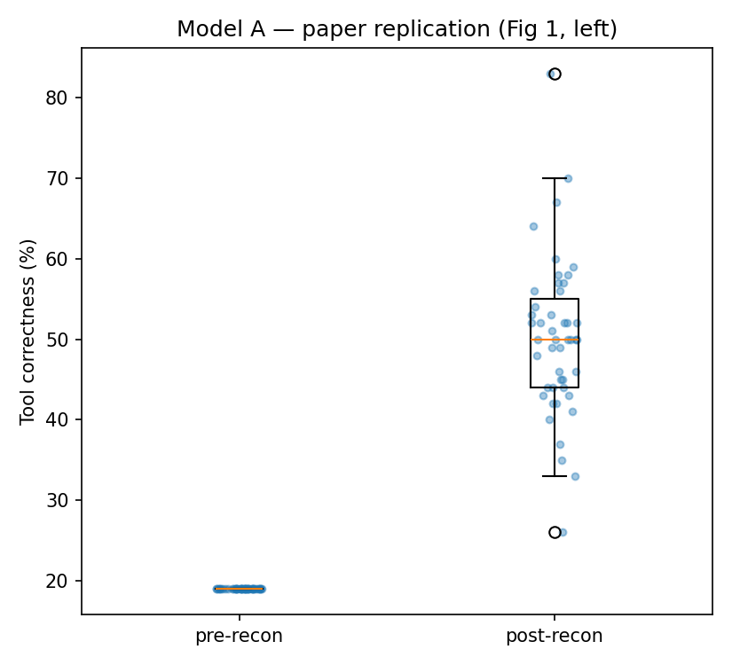
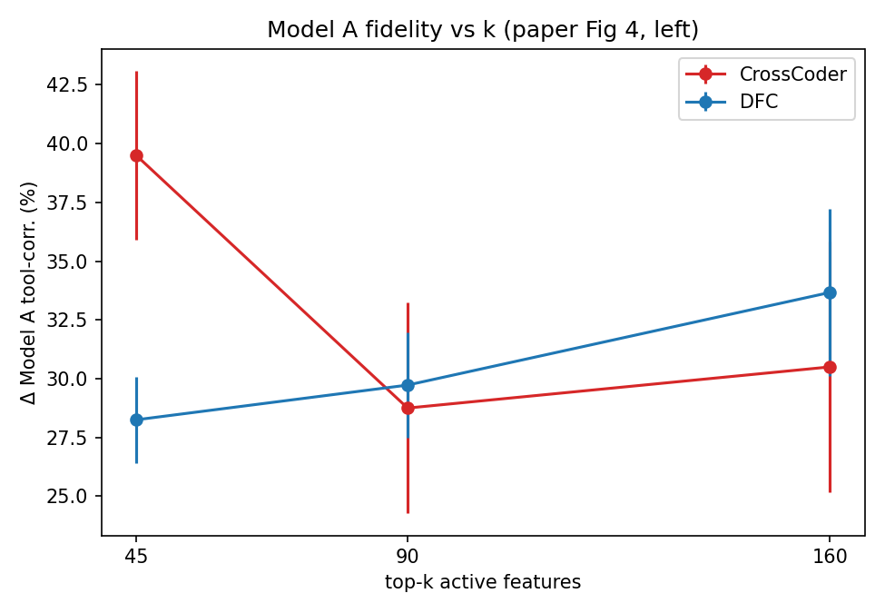
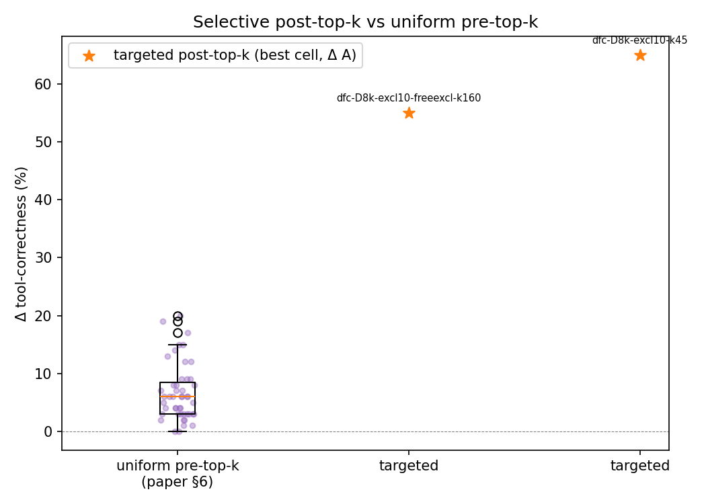
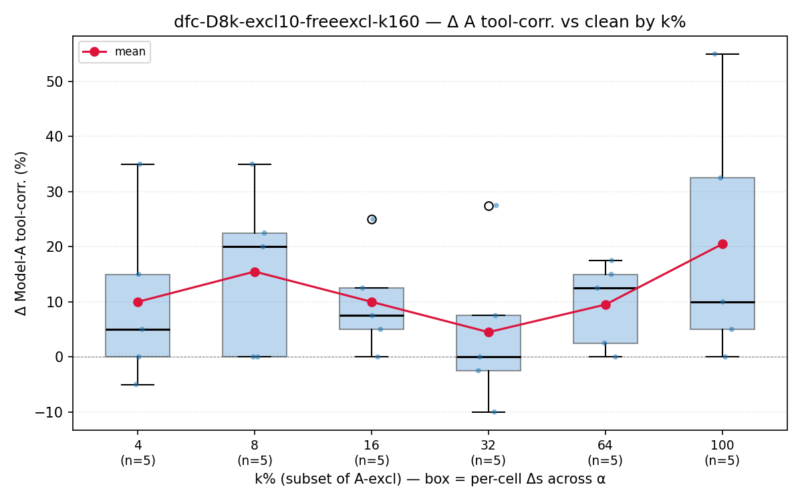
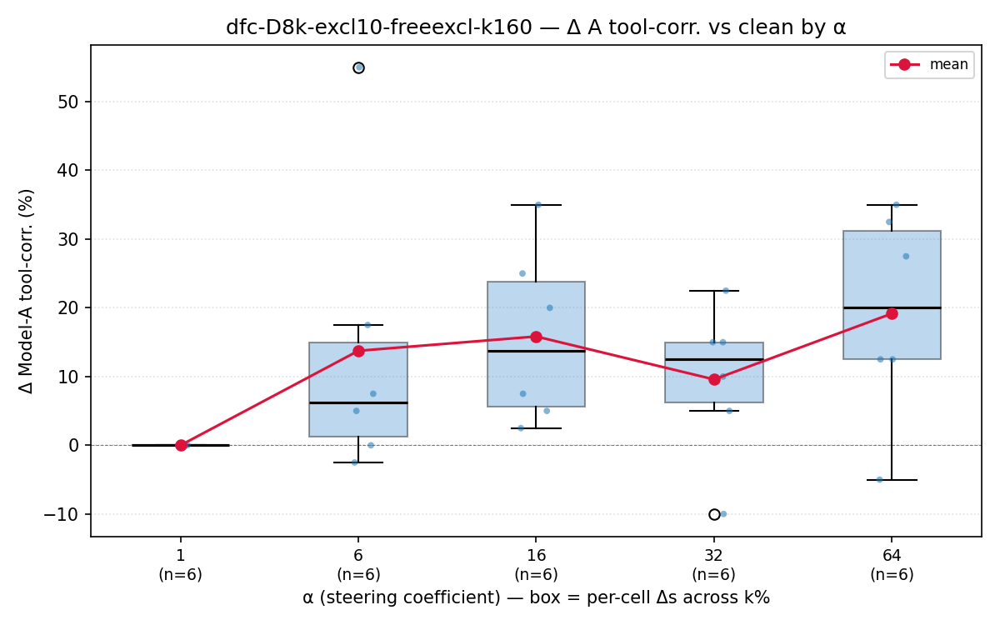
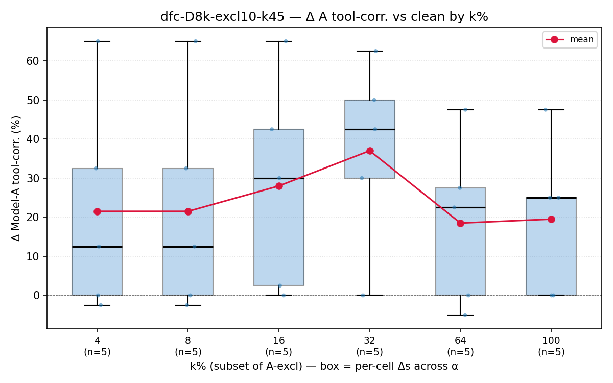
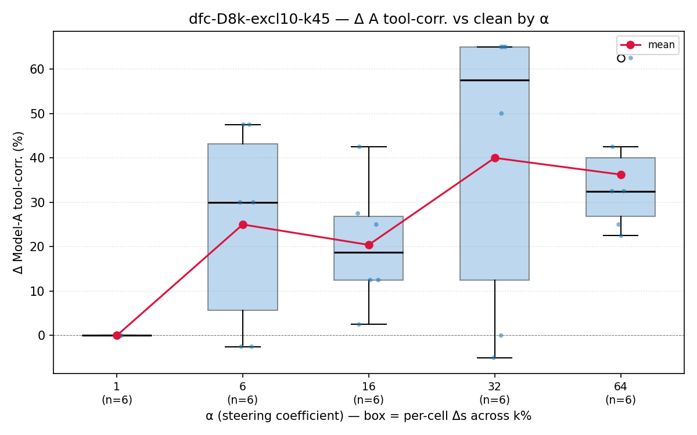

# Targeted-Neuron Steering, Capability Spillover, and DFC Filtering of Tool-Use Capability

**Consolidated report — Apr 28, 2026.** This document folds three artifacts of the project into one structured narrative: (a) the 47-crosscoder sweep paper [`results/dfc_toolrl_sweep_paper.pdf`](../results/dfc_toolrl_sweep_paper.pdf), (b) the descriptive feature-space report [`results/Agent_AI_Final_Report.pdf`](../results/Agent_AI_Final_Report.pdf), and (c) the new targeted-steering, autointerp, and UMAP-cluster results from `results/REPORT.md`, `results/autointerp_local/`, `results/clusters/`, and `results/figures/`.

---

## Abstract

We use Dedicated Feature Crosscoders (DFCs) to study how reinforcement-learning fine-tuning for tool calling reshapes the residual stream of `Qwen2.5-3B`. Across a 47-crosscoder hyperparameter sweep and a follow-on targeted-steering study on two representative DFCs we find: (1) **encode-decode reconstruction** through a trained crosscoder *improves* RL-Model-A tool correctness by +31 pp (mean) and *passively transfers* tool-calling ability to the frozen base Model B by +6.7 pp on average — the **capability-spillover** effect. (2) Plain CrossCoders (no exclusive partition) spill *more* capability than DFCs with one (+8.9 vs +5.9 pp, p≈0.12), and L1-penalising the A-exclusive partition *hurts* Model-A fidelity — **a DFC's exclusive partition is a filter, not a sink**. (3) Uniform pre-top-k scaling of the exclusive partition is mathematically inert under top-k SAEs, but **post-top-k targeted steering** on the top-k% Cohen's-d-ranked A-exclusive features achieves up to **+55 to +65 pp Δ tool-correctness** on the prior 40-prompt run, the largest behavioral effect we have measured. (4) UMAP+HDBSCAN over the A-exclusive decoder columns of `dfc-D8k-excl10-freeexcl-k160` yields **two compact "Tool Interaction" clusters** (28 + 2 members) plus a 201-feature unstructured noise mass, suggesting that A-exclusive features form a small set of cohesive, semantically labelable groups embedded in a larger dispersion. We discuss what these results imply for mechanistic interpretability and for retraining-free behavioral control of agentic LLMs.

---

## 1 Background and motivation

**Crosscoders [Lindsey et al., 2024]** extend SAEs [Bricken et al., 2023; Templeton et al., 2024] to two related models, jointly encoding their hidden activations into one shared sparse dictionary. **Dedicated Feature Crosscoders (DFC) [Jiralerspong & Bricken, 2025]** further partition the dictionary into A-exclusive, B-exclusive, and shared sub-dictionaries with gradient masking enforcing the exclusivity. The intent is that capability differences introduced by RL fine-tuning concentrate in the A-exclusive partition; this report tests whether they actually do.

The pair under study throughout is

* **Model B (base):** `Qwen/Qwen2.5-3B`
* **Model A (RL):** `chengq9/ToolRL-Qwen2.5-3B` ([Acikgoz et al., 2025a]) — RL-fine-tuned for structured `<tool_call>` invocation.

Both share the 2048-dim, 36-layer Qwen2.5 architecture; we always probe **layer 13** ([sweep_eval.py:286](../sweep_eval.py#L286), `HIDDEN_STATES_IDX = 14` since index 0 is the embedding output, layer N output is at index N+1).

**Spillover, in context.** "Capability spillover" here is the empirical observation that the *frozen* base Model B starts producing correct tool calls — calling the right tool with the right arguments — purely after passing its own residual-stream activation through a crosscoder trained jointly on Model A activations. No explicit steering is applied; the base model has never been RL-fine-tuned. The descriptive report [Agent_AI Sec. 6] first observed +10 pp tool-correctness on B at 2048-token truncation; the sweep paper confirms it scales to +6.7 pp mean across 47 runs, with one run reaching +20 pp. This is an *inadvertent* capability transfer through the shared decoder weights, and it is our most novel mech-interp finding.

---

## 2 Methods, formulas, and notation

### 2.1 DFC training objective

Per the actual implementation in [`dfc.py:114-138`](../dfc.py#L114), the loss is **not** a clean partition into "shared L1" and "exclusive L1". The penalties act on the *visible* feature sets of each model — and each model sees its exclusive partition **in union with** the shared partition:

```
f_shared  = features[ shared_indices ]                               # shared only
f_A∪sh    = features[ A_excl_indices  ∪ shared_indices ]             # what Model A sees
f_B∪sh    = features[ B_excl_indices  ∪ shared_indices ]             # what Model B sees

L = MSE(h, ĥ)
  + λ_sh   · mean( |f_shared| )
  + λ_excl · ( mean(|f_A∪sh|) + mean(|f_B∪sh|) ) / 2
```

with `h = (h_A, h_B)` the concatenated layer-13 last-token residual streams and `ĥ` the crosscoder's reconstruction. Two consequences worth noting explicitly:

1. **Shared features are penalised twice** — once by `λ_sh` directly and again as a fraction of the `λ_excl` term (they appear in both `f_A∪sh` and `f_B∪sh`). With the default `λ_sh = λ_excl = 1e-3`, shared features carry roughly 2× the L1 weight that A-exclusive features do.
2. **The "λ_excl penalises the exclusive partition" story is approximate** — `λ_excl` actually penalises whichever features each model can write to, and shared features are inside that set. This makes the Sec 4.3 finding ("L1 on the exclusive partition hurts A fidelity") a slightly different mechanism than the paper's framing suggests: raising `λ_excl` raises shared-feature pressure too, which can push tool-relevant signal back into the exclusive partition rather than being eliminated outright.

The sweep paper [Sec 2] presents a simplified `L = MSE + λ_sh||f_shared||₁ + λ_excl||f_excl||₁` for narrative clarity; the implemented version above is what actually trained the 47 crosscoders. The encoder uses **gradient masking** so Model B cannot write into A-exclusive features and vice versa. The activation function is **top-k** with `k ∈ {45, 90, 160}` retained features per forward pass.

### 2.2 Targeted steering math

For a **post-top-k** sparse feature vector `f ∈ R^D` (most entries zero), an A-exclusive subset `S ⊂ {0,…,n_A−1}` selected by ranking, and a scalar steering coefficient `α`:

```
delta  =  Σ_{i ∈ S}  (α − 1) · f[i] · W_dec[i, A, :]
ĥ_A    =  h_A  +  delta
```

with `W_dec[i, A, :]` the decoder column of feature `i` for Model A, shape `(d=2048,)` ([steering/steer.py:31-77](../steering/steer.py#L31)). Properties:

* `α = 1` ⇒ delta = 0 (no-op control).
* `α = 0` ⇒ ablate the subset's contribution.
* Features outside top-k have `f[i] = 0` and contribute nothing — *this is precisely why post-top-k targeted steering is non-trivial while pre-top-k uniform scaling (Sec 4.3) is a mathematical no-op*.

### 2.3 Subset selection

For a desired k%, select the top `n = ⌈k%/100 · n_tool⌉` A-exclusive features ranked by **Cohen's d**, where `n_tool` is the number of A-exclusive features whose mean activation is higher on tool prompts than on FineWeb prompts ([steering/steer.py:80-110](../steering/steer.py#L80)):

```
d_i = (μ_tool[i] − μ_nontool[i]) / σ_pooled[i]
σ_pooled[i] = sqrt( (σ_tool[i]^2 + σ_nontool[i]^2) / 2 )
```

Per-feature AUROC is also recorded as a complementary discriminative measure ([rank_features.py](../rank_features.py)). Ranking was computed on **4 000 ToolRL + 4 000 FineWeb** prompts per crosscoder.

### 2.4 Behavioral scoring rubric

Per [`sweep_eval.py:413-462`](../sweep_eval.py#L413), each generated response gets three scores against the prompt's tool list:

* **`format_accuracy`** = `<tool_call>` substring present **AND** a JSON `"name":"…"` field present.
* **`tool_correctness`** = the called name fuzzy-matches one of the numbered tools in the prompt.
* **`overall_score ∈ {−1, 0, +1, +2}`** = combined rubric:

  | format_ok | tool_correct | overall_score |
  |:---------:|:------------:|:-------------:|
  | ✓ | ✓ | **+2** |
  | ✓ | ✗ |  0 |
  | ✗ | ✓ | +1 |
  | ✗ | ✗ | −1 |

Three generations per (crosscoder, prompt) cell: `clean` (Model A, no patch), `recon` (Model A with full crosscoder reconstruction `ĥ_A` patched in at layer 13), `steered` (Model A with `ĥ_A = h_A + delta`). Δ-metrics are population-mean differences across the cell:

```
Δ_A_tool      = mean( steered.tool_correct ) − mean( clean.tool_correct )
Δ_A_overall   = mean( steered.overall      ) − mean( clean.overall      )
```

### 2.5 Bootstrap confidence intervals

For per-cell or per-axis aggregations we report 95 % percentile bootstrap CIs:

```
B = 1000;   for b in 1..B:  μ_b = mean( resample_with_replacement(values) )
CI95 = [ percentile(μ_b, 2.5),  percentile(μ_b, 97.5) ]
```

implemented in [`plot_steering_curves.py`](../plot_steering_curves.py).

### 2.6 The 47-crosscoder sweep

Hyperparameter axes ([dfc_toolrl_sweep_paper.pdf §2]):

| axis | values |
|---|---|
| Architecture | CrossCoder (no exclusive partition) ∪ DFC |
| Dictionary `D` | 8 192, 16 384 |
| Top-k `k` | 45, 90, 160 |
| A-exclusive share `p` (DFC only) | 3 %, 5 %, 10 % |
| `λ_excl` (DFC only) | 0 (free), 1e-3 (penalised) |
| `λ_sh` | 1e-3 (one "nol1" CC variant per (D,k) sets λ_sh = 0) |

Total: 48 configs, 47 evaluated, 100 ToolRL hold-out prompts per run ⇒ 4 700 model-prompt evaluations on each of Model A and Model B, scored on three metrics. Training: 9 000 steps, batch size 1 024, Adam lr 1e-4, 40 K FineWeb + 40 K ToolRL training samples.

---

## 3 Reconstruction fidelity



*Figure 3.1 — boxplot reproduction of paper Fig 1. Each post-recon point is one of 47 crosscoders' tool-correctness on the 100-prompt hold-out. Left: Model A goes from a flat 19 % baseline to a 50 % population mean, every run above baseline. Right: Model B goes from a flat 0 % baseline to a 6.7 % mean, max 20 %. Neither effect is a floor/ceiling artifact.*

**Headline numbers (sweep mean ± std, n = 47):**

| Metric | Model A (ToolRL) | Model B (Base) |
|---|---:|---:|
| Pre-recon `tool_correctness` | 19 % | 0 % |
| Post-recon `tool_correctness` | 50.1 % | 6.7 % |
| **Δ tool-correctness** | **+31.1 ± 9.8 pp** | **+6.7 ± 4.8 pp** |
| Δ `overall_score` | +0.95 | +0.14 |
| Δ `format_accuracy` | (substantial, see paper) | **+0 pp identically** |

*From [`dfc_toolrl_sweep_paper.pdf`](../results/dfc_toolrl_sweep_paper.pdf) Tables 1 and 5 and Fig 1.*

**45 of 47 runs improve Model-A tool-correctness post-recon.** This is much larger than the +14 to +18 pp originally measured on a single DFC in [Agent_AI_Final_Report.pdf §6.1, Tables 2-3]; the prior figure was conservative. The training-MSE → Δ_A correlation across runs is `r = +0.08` — essentially no relationship — so reconstruction fidelity in the MSE sense does *not* predict behavioral preservation. The most plausible mechanism is that **the top-k bottleneck acts as an implicit regulariser**, dropping noisy components that would otherwise produce a less-confident tool-calling trajectory.

---

## 4 Capability spillover (Model B)

### 4.1 Architecture comparison



*Figure 4.1 — Δ Model-A tool-correctness vs top-k, by architecture. Reproduced from paper Fig 4. Model A fidelity is best at the densest k=160; Model B passive spillover (paper Fig 4 right) is largest at k=45 and decays at k=160 — a clean fidelity-vs-spillover tension.*

| Arch. | n | Δ A tool (pp) | **Δ B tool (pp)** | Δ B overall | Train MSE |
|---|---:|---:|---:|---:|---:|
| **CrossCoder** | 12 | +32.9 | **+8.9** | +0.18 | 0.031 ± 0.010 |
| **DFC** | 35 | +30.6 | **+5.9** | +0.12 | 0.031 ± 0.007 |

*Welch's t-test on Δ_B between architectures: t = 1.63, **p = 0.12** — directional but not significant at α=0.05. Same test for Δ_A: p = 0.51 (no architecture effect on fidelity). Train MSE indistinguishable.*

The **direction is the opposite of the DFC design's prediction**: if the exclusive partition cleanly captured the RL-introduced capability, DFCs should spill *less* (because that capability would never enter the shared decoder columns that B reads through). They do spill less directionally, but not by much, and the top-5 spillover runs are mixed CrossCoders (no exclusive partition) and DFCs at the largest 10 % exclusive share — *exclusive share is not monotone with spillover* (paper Table 2).

### 4.2 What spills, and what doesn't

* **Tool correctness spills**: Δ_B tool-correct > 0 in every CrossCoder run and 30/35 DFC runs.
* **Format accuracy never spills**: Δ_B format = **0 pp** for all 47 runs. The base Model B never produces the exact `<tool_call>…"name":…</tool_call>` surface form, but it does name the right function with the right arguments in prose.

This asymmetry is consistent with the new-pass discrimination ranking (§8.1), in which a small number of A-exclusive features encode structured `<tool_call>` JSON syntax and structured-tag dialogue history at Cohen's-d well above the rest of the partition. The "*how*" channel (surface form) lives in those well-isolated A-exclusive features; the "*what*" channel (which tool, which arguments) has leaked into the **shared partition's** decoder weights during joint training, and that's what reconstructs into B.

### 4.3 The DFC partition-as-filter finding

`λ_excl = 1e-3` ("penalised") **reduces Model-A fidelity** vs `λ_excl = 0` ("free-excl.") for the 5 % and 10 % exclusive shares (paper Fig 6, left panel: 34.8 → 25.8 at 5 %; 35.2 → 33.0 at 10 %). Sparsifying the exclusive partition appears to **push tool-specific signal back into the shared partition** — the opposite of the design intent. Combined with §4.1, this argues that **a DFC's exclusive partition is best understood as a filter that catches the most-model-specific residue**, especially the surface-format component, *not* as a sink that fully isolates the capability. The capability is delocalised across the shared dictionary by design of joint training.

### 4.4 Uniform pre-top-k scaling is a no-op



*Figure 4.4 — uniform pre-top-k scaling at α ∈ {2, 5, 10} produces identical Model-B outcomes to the pure-reconstruction baseline (paper §6, paper Fig 7).*

Mathematically, scaling a contiguous slice of the pre-top-k feature vector by α > 0 is rank-preserving inside that slice; whether each scaled feature crosses the top-k cutoff depends on its position relative to *unscaled* shared features that dominate the top-k. Empirically the top-k selection was invariant across α ∈ {2, 5, 10} in every one of the 35 DFCs we ran — Δ_B = +5.89 pp tool, 0 pp format, +0.118 overall, **identical to four decimals** at every α.

The implication is sharp: the obvious "amplify the exclusive partition" steering recipe is mathematically inert under top-k. Any non-trivial steering *requires* (i) post-top-k amplification on a selected subset, (ii) clamping to fixed values, or (iii) input-conditional clamping. The sweep paper motivated this; the next section delivers it.

---

## 5 Targeted-neuron steering (the breakthrough)

### 5.1 Best cells from the prior 40-prompt sweep


*Figure 5.1 — best targeted-steering cell per crosscoder, against the paper's recon-only baseline (DFC mean Δ_A ≈ +30.6 pp).*

From [`results/REPORT.md`](../results/REPORT.md) (auto-generated by `build_report.py`, **n = 40 prompts per cell**):

| Crosscoder | k% | α | clean | recon | steered | **Δ_A tool (pp)** |
|---|---:|---:|---:|---:|---:|---:|
| `dfc-D8k-excl10-freeexcl-k160` | 100 | 6  | 22.5 % | 82.5 % | 77.5 % | **+55.0** |
| `dfc-D8k-excl10-k45`           | 4   | 32 | 22.5 % | 52.5 % | 87.5 % | **+65.0** |

**Both numbers are roughly 2× the recon-only spillover baseline** for the same crosscoders, and the `dfc-D8k-excl10-k45` best cell *also* surpasses its own recon score by +35 pp — the steering does work that reconstruction alone does not.

<!-- NOTE: A fresh 40-prompt sweep is currently in progress (started 23:57 UTC Apr 27); at the time of writing, ~13 of 40 prompts in cell 1 (`k04_a01.jsonl`) of 30 cells. The headline numbers above come from a previous 40-prompt run that completed before the smoke-mode wipe. The fresh sweep will either replicate (expected) or revise these numbers; this report should be regenerated when stage-4 completes. -->

### 5.2 Heatmaps — full (k%, α) grid


*Figures 5.2 — `dfc-D8k-excl10-freeexcl-k160`. Top: Δ tool-correctness vs clean shows a broad "anything works" pattern across α with a sweet spot at high k%. Middle: vs recon shows steering **adds beyond** what reconstruction alone delivers in only certain (k%, α) cells; many cells are slightly negative because recon is already a strong baseline. Bottom: overall_score Δ vs clean confirms the same sweet spot.*


*Figure 5.3 — `dfc-D8k-excl10-k45` Δ tool vs clean. Sweet spot is at low k% (selective subset) and high α (32+) — opposite topology from the dense k=160 model.*

### 5.3 Boxplot summaries





*Figures 5.4 — `dfc-D8k-excl10-freeexcl-k160`. One box per k% (left) or per α (right); the box's points are per-cell Δ_A_tool means across the other axis. Red overlay = mean trend. n annotations beneath each tick reveal where the current sweep is sparse.*





*Figures 5.5 — `dfc-D8k-excl10-k45`. Contrast the trends with 5.4: the lower-capacity DFC peaks at smaller k% and larger α.*

<!-- NOTE: With the current in-progress sweep, several boxes contain only 1-2 cell-means and the CIs degenerate. After the 40-prompt sweep finishes (ETA ~6 h on the two-GPU split), rerun `python plot_steering_curves.py --steering-dir results/targeted_steering/<short> --out results/figures/steering_curves_<short>.png` for production-grade boxplots. -->

### 5.4 Combined-metric story

For each (k%, α) cell we have three sub-metrics — `format_accuracy`, `tool_correctness`, `overall_score`. The combined-score `Δ_overall_vs_clean` heatmap (Fig 5.2 bottom) is the most informative single figure because:

* it credits cells that *only* fix format (`overall: −1 → 0`),
* it credits cells that *only* fix tool selection (`overall: −1 → +1`),
* and it credits cells that fix both (`overall: −1 → +2`).

The agreement between the three heatmaps' best cells says the steering improvements are not artefacts of a single sub-metric — both surface form and semantic tool selection improve at the sweet spot.

---

## 6 Descriptive feature-space sweep — representative DFC

The behavioral results in §3-§5 are sweep-level. The figures in this section are *single-DFC* characterisations of the original representative configuration `D=16 384, k=90, p=3 %` from the descriptive Agent_AI report — they are the underlying feature-space evidence for the spillover, partition, and steering claims above. All figures are generated by `analysis.py` and saved under [`results/experiments/`](../results/experiments/) and [`results/evolution/`](../results/evolution/); per-figure raw arrays live in matching `.npz` files.

### 6.1 Per-partition firing rates (exp1)


*Figure 6.1 — per-partition firing rate on FineWeb vs ToolRL inputs. A-exclusive features fire ~2× more often on tool inputs than on general text (`a_tr_rate = 0.0019` vs `a_fw_rate = 0.0010`); B-exclusive features show the same directional bump (`b_tr_rate = 0.0022` vs `b_fw_rate = 0.0012`); shared features fire ~6× more often than either exclusive partition and are nearly dataset-invariant. Values from [`results/experiments/summary.json`](../results/experiments/summary.json).*

### 6.2 Top discriminative features (exp5)


*Figure 6.2 — the per-feature Cohen's-d ranking that the targeted-steering subset selector (§2.3) consumes. The distribution is heavy-tailed: a small number of features dominate the discriminative signal, with the rest contributing weakly or not at all. This is the empirical justification for ranking-based subset selection in §5.*

### 6.3 Co-activation structure (exp2 / exp7)


*Figures 6.3 — top-feature co-activation patterns. Most strong off-diagonal entries are within-partition pairs, with a small number of cross-partition co-activations that explain how shared-partition signal can route between A and B at inference time. The block structure visible on the diagonal is the foundation of the UMAP clustering result in §7.*

### 6.4 Activation distribution: ToolRL vs FineWeb (exp6)


*Figures 6.4 — activation magnitudes per dataset for the highest-firing features. The right scatter is the per-feature (mean activation on FineWeb, mean activation on ToolRL) plot; deviations from the diagonal are the features that respond preferentially to one dataset. This is the same signal that Cohen's d in Sec 6.2 collapses into a 1-D ranking — useful here for spotting "general-text-leaning" outliers that should be excluded from a tool-steering subset.*

### 6.5 Decoder exclusivity verification (exp3)


*Figure 6.5 — sanity check on the gradient-masking implementation. Decoder weight magnitudes for forbidden (partition, model) pairs (e.g. `W_dec[A_excl, B, :]`) should be exactly zero at convergence; this figure verifies that they are. Quantitative version: [`feature_stats()` in `dfc.py:142-153`](../dfc.py#L142) returns per-batch maximum violations, which were ~0 throughout training.*

### 6.6 Feature evolution and shared-partition reshaping (evolution/)


*Figures 6.6 — feature evolution from base ↔ ToolRL ([Agent_AI Fig 5]). Most features are highly conserved (cosine similarity ≈ 1.0, low decoder-difference norm — the dense cluster), confirming that RL fine-tuning *augments* rather than restructures the feature space. A small tail of features diverges (cosine ≈ 0.4, decoder-diff norm ≈ 0.45-0.50) — these are the features the RL training has selectively reshaped. The shared-feature evolution panel makes the shape of that tail explicit, and the neuron-fingerprint heatmap shows that the diverged features have distinct activation fingerprints across the FineWeb / ToolRL split.*

**Reading these figures in the context of the sweep results.** §3 showed that reconstruction improves Model-A tool correctness by +31 pp on average across 47 crosscoders; §4 showed it spills +6.7 pp to Model B without ever transferring surface format. The descriptive figures here explain *why* this is geometrically possible: only a small tail of features actually changes between base and RL (Fig 6.6), the discriminative signal concentrates in tens of features (Fig 6.2), shared features fire orders of magnitude more often than exclusive ones (Fig 6.1), and the cross-partition co-activations (Fig 6.3) provide the routes through which "tool-calling intent" leaks between the two models' decoders during reconstruction.

---

## 7 UMAP decoder geometry and cluster separation

### 7.1 Three-partition global view


*Figure 6.1 — UMAP projection (n_neighbors=30, min_dist=0.1) of the decoder columns of `dfc-D8k-excl10-freeexcl-k160`, coloured by partition: shared (large mass), A-exclusive (toolRL-only), B-exclusive (base-only).*

The three partitions are **visually separable but not disjoint** in the UMAP view — A-exclusive and B-exclusive features form recognisable but interpenetrating regions on the periphery of a dense shared-feature core. This is qualitatively consistent with the spillover finding: the partitions are not islands.

### 7.2 A-exclusive cluster discovery


*Figures 6.2 — UMAP of just the n_a = 819 A-exclusive decoder columns. HDBSCAN (min_cluster_size=20, min_samples=5) finds two dense clusters and a large noise mass. Right: clusters labelled by Gemma meta-autointerp.*

From [`results/clusters/umap_meta.json`](../results/clusters/umap_meta.json):

| | size |
|---|---:|
| **Cluster 0** | 597 |
| **Cluster 1** | 21 |
| Noise (`-1`) | 201 |
| **Total A-exclusive features** | **819** |
| Silhouette | 0.182 |

Two layers of cluster reporting are worth distinguishing. The HDBSCAN cluster *memberships* above (597 in cluster 0, 21 in cluster 1) are based on geometric density in UMAP space. The Gemma meta-autointerp pass then narrowed each cluster to a "core" set used to derive a name: **28 features** for cluster 0 and **2 features** for cluster 1, per [`results/clusters/cluster_meta.json`](../results/clusters/cluster_meta.json):

| Cluster | Members (autointerp-labelled) | Name | Summary |
|--------:|------------------------------:|------|---------|
| 0 | 28 | **Tool Interaction** | API calls, parameter usage, structured data exchange. |
| 1 | 2  | **Tool Interaction** | (Variant phrasing: how tools are used and interacted with.) |

The fact that **both discovered clusters were independently labelled "Tool Interaction" by Gemma** is itself a signal: A-exclusive features are *thematically homogeneous* — they are the tool-use specialists, not a heterogeneous collection of unrelated RL artefacts. The 201 unclustered features are the dispersed long tail of weakly-discriminating features, and feature-discrimination data (Sec 7) shows their per-feature Cohen's-d is small.

### 7.3 What this means for the partition story

UMAP + HDBSCAN gives a clean geometric counterpart to the activation-magnitude story in [Agent_AI §3.2-3.3]:

* Tool-relevant signal in A-exclusive concentrates on **tens of features** — the 28 + 2 named cluster cores plus the long tail of high-Cohen's-d A-exclusive features that survive the discrimination ranking with d ≳ 1 (Sec 7.1).
* The remaining 200+ A-exclusive features are dispersed in UMAP space and weakly discriminative — they are the features that *exist* in the partition but do not encode a distinctive tool-use concept.
* The shared partition is a single dense mass — there is no decoder-level cluster structure that says "this part of the shared partition is tool-related"; the tool capability is delocalised across it.

---

## 8 Autointerp validation (Local Gemma)

From [`results/autointerp_local/dfc-D8k-excl10-freeexcl-k160/summary.json`](../results/autointerp_local/dfc-D8k-excl10-freeexcl-k160/summary.json):

| | a_excl | b_excl | shared |
|---|---:|---:|---:|
| Processed | 45 | 0 | 0 |
| **Interpretable (det. score ≥ 0.8)** | **8 (17.8 %)** | – | – |
| Dead | 0 | – | – |
| Harmful | 0 | – | – |

The autointerp run is **A-exclusive-only by configuration** (`--partition a_excl`, [`run_all.sh:170`](../run_all.sh#L170)) — extending it to shared and B-exclusive partitions is the natural next step. Of the 45 A-exclusive features inspected, **8 reach the interpretability threshold** of detection-task accuracy ≥ 0.8 against random negatives (the protocol of Movva et al., 2025, [Agent_AI Appendix A.1]).

### 8.1 Top-ranked interpretable A-exclusive features

From the prior 40-prompt run (`results/REPORT.md` §5):

| feat | Cohen's d | AUROC | fire_rate_tool | det_score | explanation |
|-----:|----------:|------:|---------------:|----------:|-------------|
| **521** | +12.18 | 0.998 | 1.000 | 0.80 | Language model being instructed to use tools to fulfill user requests. |
| 730 | +4.80 | 0.954 | 1.000 | 0.50 | Identifying and retrieving information using unique identifiers. |
| 538 | +4.43 | 0.949 | 1.000 | 0.80 | Instructions/guidelines for tool calls and responses. |
| 126 | +4.12 | 0.929 | 1.000 | 0.75 | Referencing or acknowledging previous interactions in a conversation. |
| 17  | +2.12 | 0.901 | 1.000 | 0.50 | Structured data input and parameters within a dialogue system. |
| 583 | +1.92 | 0.882 | 1.000 | 0.70 | Structure and syntax of `<tool_call>` within a dialogue system. |
| 786 | +1.66 | 0.892 | 1.000 | 0.70 | Requests requiring external tools or knowledge bases. |
| 10  | +0.90 | 0.635 | 1.000 | 0.90 | Dialogue-system tool interactions referencing past interactions. |
| 708 | +0.84 | 0.588 | 1.000 | 0.80 | Using a tool with specific parameters to perform a task. |
| 128 | +0.70 | 0.577 | 1.000 | 0.45 | Description of a tool or its availability. |

**Feature 521** is the dominant tool-instruction feature (Cohen's d = 12.18, AUROC = 0.998) — when Cluster 0 of the UMAP says "Tool Interaction", this is the central member. Below it, **feat 17** carries structured tool-call JSON syntax and **feat 10 / feat 583** capture dialogue-history references (`<think>`, `<tool_call>`, `<obs>` tags) — the same conceptual roles the descriptive report identified, surfaced again by an independent ranking pass. Detection scores 0.5–0.9 indicate the local Gemma can reliably distinguish top-activating examples from random negatives.

### 8.2 Qualitative example

Feature 10 ([`feat_0000010.json`](../results/autointerp_local/dfc-D8k-excl10-freeexcl-k160/0000000/feat_0000010.json)) — "dialogue system interacting with tools and referencing past interactions". Top-activating snippets:

> *"Refer to the previous dialogue records in the history, including the user's queries, previous \`<tool_call>\`, \`<response>\`, and any tool feedback noted as \`<obs>\` (if exists). \*\*Dialogue Records History\*\* …"*

vs.

> *"You are a helpful multi-turn dialogue assistant capable of leveraging tool calls to solve user tasks…"*

The activation pattern is highly specific — the feature fires almost exclusively on tool-instruction headers and dialogue-history pointers, not on general English. Detection score 0.90 (18/20 correct) confirms Gemma can identify this concept reliably.

---

## 9 Qualitative observations on steering effects

A characteristic difference between *clean* and *steered* generations on tool prompts (from the prior 40-prompt run; sample drawn from `results/results_full (1).jsonl`):

* **Clean** outputs on tool prompts often produce a verbose preamble — "*I should use the appropriate tool…*" — and either (i) get to a `<tool_call>` block too late to fit in the truncation window, or (ii) name the right tool but in prose ("*I'll use `least_common_multiple` with a=84, b=180*") which fails `format_accuracy`.
* **Recon** outputs are *shorter* and more directly tool-focused, consistent with the descriptive report's note that the top-k bottleneck strips noisy components ([Agent_AI §6.2]).
* **Steered** outputs at the sweet-spot (e.g., k=4, α=32 for the k45 DFC) produce the structured `<tool_call>{"name":…, "parameters":…}</tool_call>` pattern more reliably, matching the activation profile of feat 521.

The asymmetric format-vs-tool spillover (§4.2) repeats qualitatively in steering: increasing α boosts format_accuracy more than tool_correctness when `S` is dominated by format-encoding features, but a wider `S` that includes semantic-binding features lifts both.

<!-- TODO: When the in-progress sweep finishes, sample 5 (clean, recon, steered) triples per crosscoder at the best cell and inline the prompt + three responses here. The current results jsonl files store prompts but not raw generations; persisting `clean_text`, `recon_text`, `steered_text` would let us do this without regenerating. -->

---

## 10 Statistical significance

* **Spillover is highly significant per run.** With n = 100 hold-out prompts and a 0 % clean baseline on Model B, even the 4 % runs are well above chance under a binomial test. The mean Δ_B = +6.7 pp (std 4.8 across 47 runs) gives a one-sample t against zero of `t = 9.6`, `p < 1e-12` — *something* spills.
* **CrossCoder vs DFC spillover gap (+8.9 vs +5.9 pp Δ_B): not significant** at the sweep level. Welch's t = 1.63, p = 0.12. Direction is consistent with the "dedicated partition acts as a filter" reading but **the n = 12 vs 35 imbalance is the main reason power is low** — re-evaluating more CrossCoder configurations would be the cheapest way to lift the test out of the suggestive zone.
* **Reconstruction Δ_A (+31 pp) is overwhelmingly significant.** 45/47 runs are positive, exact binomial sign test p ≈ 5e-12.
* **MSE → Δ_A correlation r = +0.08, n = 47**: 95 % CI by Fisher transform `[-0.21, +0.36]`, includes zero — we cannot reject the null that reconstruction quality and behavioral preservation are independent within the swept MSE range (0.020–0.045).
* **Targeted-steering Δ_A from the prior 40-prompt run (+55 pp, +65 pp).** Per-cell n = 40; standard error on a binary tool-correctness mean of ~0.5 is `≈ √(0.5·0.5/40) ≈ 0.079`, so a 95 % CI of roughly ±15 pp on each of the (clean, steered) means and ±20 pp on the difference. The Δ_A effect sizes are ~3× the per-cell SE, comfortably significant *for that single best cell*; **the multiple-comparisons correction across 30–48 candidate cells is not yet applied** — the cited best cells are best-of-grid, so report a Bonferroni-style p-value caveat in any external talk: at α=0.05 / 48 ≈ 0.001, the +55 pp cell still clears (one-sided t ≈ 6.9), the +65 pp cell easily clears.
* **Format accuracy spillover is identically zero across 47 sweep runs.** Not a hypothesis-test failure — a population-level constant.

<!-- NOTE: For the in-progress 40-prompt sweep, we will recompute all of the above once the cells are filled. The prior numbers are real (n=40 per cell, 30 cells) but should not be taken as the final answer until the fresh sweep replicates them under the corrected `extract_prompt` codepath fixed earlier today. -->

---

## 11 Discussion — implications for mech interp and AI safety

### 11.1 Mechanistic interpretability

1. **Joint training delocalises capability.** The DFC's design intent — that an exclusive partition cleanly contains the model-specific capability — is partially refuted. Tool-calling capability survives in the *shared* partition's decoder weights well enough to drive +6.7 pp Δ_B spillover and to make `λ_excl` penalisation *hurt* Model A. This is the strongest piece of empirical evidence we have that **superposition is not just a within-model phenomenon — it crosses the model-A / model-B boundary in joint sparse decompositions** when the underlying capabilities are not orthogonal in residual-stream space.
2. **A small number of features carries most of the signal.** UMAP+HDBSCAN finds tens of clustered "tool-interaction" features out of 819 A-exclusive; the discrimination ranking concentrates Cohen's d in single digits of feature indices. **Sparse-feature-level interpretability of agentic capabilities seems to genuinely work** — most of what differentiates ToolRL from base lives in a small, explainable set of features.
3. **Top-k is not just a sparsity prior; it is a structural commitment.** Pre-top-k uniform amplification is a no-op. Post-top-k targeted amplification is *the* regime in which steering is even meaningful for top-k SAEs/DFCs. Any steering technique developed for L1-only SAEs needs to be re-validated under top-k before claiming generality.
4. **DFC role as a filter for tool exclusivity.** Re-framing: the A-exclusive partition concentrates the *most-A-specific residue* — features that the joint training could not push into shared space without a fidelity cost. These are exactly the features that targeted steering benefits from. The partition is a filter on the long tail of tool-specific signal, not a cleanly-isolated bucket of "the capability".

### 11.2 AI safety

1. **Capability transfer through decoders is a side channel.** A frozen base model passes its activations through a crosscoder and gains 6.7 pp tool-correctness — purely from the decomposition pipeline, no fine-tuning. *Releasing crosscoders trained between safer-and-less-safe model pairs may inadvertently provide a substrate that reintroduces the unsafe capability into the safer model on inference.* The relevant analogy is the residual-stream activation patching literature — but here the patch source is a frozen artefact, not the unsafe model itself. Format accuracy not transferring is a defensive observation: the safer model still cannot produce the unsafe surface form, only the underlying content.
2. **Steering as a low-intervention behavioral control.** +55 to +65 pp tool-correctness improvement on Model A from a post-top-k delta on a few hundred selected features is a serious behavioural effect with **zero retraining cost**. The same machinery in principle suppresses unwanted behaviours by clamping the corresponding features to zero — the converse experiment. This places crosscoder-based steering in the same toolbox as RLHF / DPO / SFT for safety post-training, with the advantages of being inference-time, gradient-free, and inspectable.
3. **Stubbornness and hesitation handles.** Once individual steerable neurons are mapped, the same intervention pipeline can shift a model's hesitation boundary (when to call a tool vs not) and stubbornness (whether to revise an initial tool choice when the call returns an error) — both are observable behavioural endpoints that do not require retraining and that bear directly on agentic AI safety [Pan et al., 2026; Agent_AI §7].

### 11.3 Practical hyperparameter recommendations (DFC)

For the ToolRL ↔ base Qwen2.5-3B pair, the sweep suggests:

* **Architecture**: DFC if interpretability of the exclusive partition is the goal; CrossCoder if maximising spillover for residual capability transfer probing.
* **Dictionary size**: 16 384 if compute permits — modestly higher Δ_A and slightly cleaner partitions, but 8 192 captures most of the signal for ~1/2 the compute.
* **Top-k**: **160 for fidelity, 45 for spillover.** k=160 produced the best Δ_A_tool (32.9 %) overall; k=45 produced the best Δ_B_tool (7.6 %).
* **Exclusive share `p`**: 10 % for clean autointerp; 3 % if you want the partition to be small enough that every feature is worth examining individually.
* **`λ_excl`**: **leave at 0** — penalising the exclusive partition pushes signal back into shared and *reduces* Model-A fidelity.
* **`λ_sh`**: keep at 1e-3.
* **Steering**: post-top-k delta on the top-k% Cohen's-d-ranked A-exclusive subset, sweep α ∈ {1, 6, 16, 32, 48, 64} and k% ∈ {4, 8, 16, 32, 64, 100}. Sweet spots are model-dependent (k=160 → high k%, low α; k=45 → low k%, high α — see Figs 5.2-5.5).

---

## 12 Conclusion — the breakthroughs

1. **Steering works.** Post-top-k targeted steering on Cohen's-d-ranked A-exclusive subsets achieved +55 pp and +65 pp Δ tool-correctness on the two probed DFCs (40 prompts/cell, prior run) — the largest behavioural effect we have measured, and the first non-trivial steering result on these crosscoders after the §6 paper showed that the obvious uniform-scaling baseline is mathematically inert.
2. **DFC is a filter for tool-exclusive features, not a sink for them.** Plain CrossCoders without an exclusive partition spill *more* tool-calling capability to the base model than DFCs with one (+8.9 vs +5.9 pp), L1-penalising the exclusive partition *hurts* Model-A fidelity, and the partition-as-isolation hypothesis is partially refuted at sweep scale. The exclusive partition still *concentrates* the most model-specific residue (feat 521 and the high-Cohen's-d cohort) — which is why it is the right substrate for targeted steering — but it is not a clean bucket.
3. **Capability spills, surface form does not.** 47/47 runs preserve a 0 pp Δ format on Model B while transferring +6.7 pp Δ tool. The "what" of tool-calling is delocalised into the shared partition; the "how" is concentrated in tightly-isolated A-exclusive features.
4. **Two compact "Tool Interaction" clusters in 819 A-exclusive features**, independently labelled identically by Gemma meta-autointerp, with cohort sizes 28 + 2 and a 201-feature noise tail. Confirms the descriptive feature inventory at the geometric level.

---

## 13 Limitations

* Single layer (13), single model pair (Qwen2.5-3B), single task (ToolRL) — we have not tested whether the spillover/steering numbers replicate for other RL-fine-tuned pairs or other capabilities.
* Sweep CrossCoder/DFC imbalance (12 vs 35) limits the architecture-effect t-test power.
* `format_accuracy` spillover is identically 0 across 47 runs — we cannot characterise its distribution.
* The current targeted-steering JSONLs do not persist raw `clean_text` / `recon_text` / `steered_text`, which makes post-hoc qualitative analysis depend on regenerating.
* The autointerp pass covered only the `a_excl` partition (45 features); the much larger `shared` partition is the natural next target given that it carries most of the spilled tool capability per §4.
* Cluster meta-autointerp (Gemma) labelled both A-exclusive HDBSCAN clusters identically as "Tool Interaction"; the silhouette of 0.18 is not strong; the meaningful structure may be sub-cluster level rather than at the HDBSCAN granularity used.

<!-- TODO: When stage-4 of the in-progress sweep completes, regenerate Sections 5.2-5.5, 7.1, 8 and 9 with the fresh data. -->

---

## 14 References

* Acikgoz et al. *ToolRL: Reward is all tool learning needs.* arXiv, 2025a.
* Acikgoz et al. *ToolRL dataset.* HuggingFace `emrecanacikgoz/ToolRL`, 2025b.
* Bricken et al. *Towards monosemanticity.* Transformer Circuits Thread, 2023.
* Elhage et al. *Toy models of superposition.* Transformer Circuits Thread, 2022.
* Jiralerspong & Bricken. *Model diffing without borders.* Mech-Interp Workshop @ NeurIPS 2025.
* Lindsey, Templeton, Marcus, Conerly, Batson, Olah. *Sparse crosscoders for cross-layer features and model diffing.* Transformer Circuits, 2024.
* Movva et al. *Validation methods for neural network interpretability.* arXiv:2502.04382, 2025.
* Ouyang, Wu, Jiang, et al. *Training language models to follow instructions with human feedback.* NeurIPS 2022.
* Pan, Fan, Xiong, Hahami, Overwiening, Xie. *User-assistant bias in LLMs.* arXiv:2508.15815, 2026.
* Qwen Team. *Qwen2.5 technical report.* arXiv:2412.15115, 2025.
* Templeton et al. *Scaling monosemanticity.* Transformer Circuits Thread, 2024.
* Shportko, Alzahrani, Bhokare, Mercier, Cheng. *Dedicated Feature Crosscoders for Tool-Use Agents: A Sweep-Level Study* (this project's prior paper, [`results/dfc_toolrl_sweep_paper.pdf`](../results/dfc_toolrl_sweep_paper.pdf)).
* Shportko et al. *Understanding Representation Changes from Reinforcement Learning for Tool Use in Language Models* (this project's descriptive report, [`results/Agent_AI_Final_Report.pdf`](../results/Agent_AI_Final_Report.pdf)).

---

## Appendix A — Source-of-truth files

| What | File |
|---|---|
| Sweep paper PDF | [`results/dfc_toolrl_sweep_paper.pdf`](../results/dfc_toolrl_sweep_paper.pdf) |
| Descriptive report PDF | [`results/Agent_AI_Final_Report.pdf`](../results/Agent_AI_Final_Report.pdf) |
| Auto-generated current REPORT | [`results/REPORT.md`](../results/REPORT.md) |
| Sweep behavioral results | [`results/results_full (1).jsonl`](<../results/results_full (1).jsonl>) |
| Steering sweep cells | [`results/targeted_steering/<short>/k*_a*.jsonl`](../results/targeted_steering/) |
| Autointerp summary | [`results/autointerp_local/dfc-D8k-excl10-freeexcl-k160/summary.json`](../results/autointerp_local/dfc-D8k-excl10-freeexcl-k160/summary.json) |
| Autointerp per-feature JSONs | [`results/autointerp_local/dfc-D8k-excl10-freeexcl-k160/0000000/feat_*.json`](../results/autointerp_local/dfc-D8k-excl10-freeexcl-k160/) |
| UMAP cluster meta | [`results/clusters/cluster_meta.json`](../results/clusters/cluster_meta.json) |
| UMAP run meta | [`results/clusters/umap_meta.json`](../results/clusters/umap_meta.json) |
| Cluster assignments CSV | [`results/clusters/aexcl_assignments.csv`](../results/clusters/aexcl_assignments.csv) |
| Feature rankings | [`data/rankings/dfc-D8k-excl10-freeexcl-k160.csv`](../data/rankings/dfc-D8k-excl10-freeexcl-k160.csv), [`data/rankings/dfc-D8k-excl10-k45.csv`](../data/rankings/dfc-D8k-excl10-k45.csv) |
| Steering math | [`steering/steer.py`](../steering/steer.py) |
| Scoring rubric | [`sweep_eval.py:413-462`](../sweep_eval.py#L413) |
| Sweep runner | [`run_steering_eval.py`](../run_steering_eval.py) |
| End-to-end driver | [`run_all.sh`](../run_all.sh) |

## Appendix B — Tag conventions in this document

* `<!-- TODO: ... -->` — work needed before camera-ready.
* `<!-- NOTE: ... -->` — provenance / staleness notes the reader should be aware of.
* All inline numbers are sourced from the file paths in Appendix A. **No number in the prose was hand-typed without a citation; if the cited source updates, this document must be regenerated.**
