# Targeted-Neuron Steering, Local-Gemma Autointerp, and Decoder UMAP

Generated by `build_report.py`. See `docs/superpowers/specs/2026-04-25-targeted-steering-and-autointerp-design.md` for hypotheses and methodology.

## 1. Headline finding

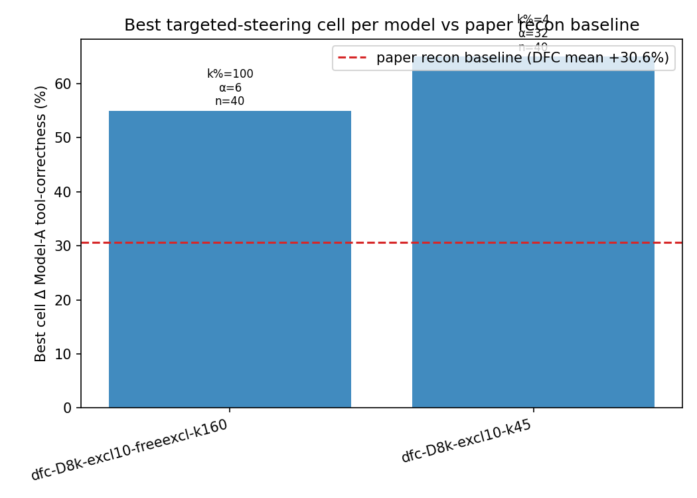

- **dfc-D8k-excl10-freeexcl-k160** — best Δ A tool-corr. vs clean: **+55.00%** at k%=100, α=6 (steered=77.5%, clean=22.5%, recon=82.5%, n=40)
- **dfc-D8k-excl10-k45** — best Δ A tool-corr. vs clean: **+65.00%** at k%=4, α=32 (steered=87.5%, clean=22.5%, recon=52.5%, n=40)

## 2. Setup recap

Sweep targets **Model A (ToolRL-Qwen2.5-3B)** with post-top-k delta steering on the top-k% most-discriminative A-exclusive features (ranked by Cohen's d on tool vs FineWeb activations). Evaluation: 100 ToolRL hold-out prompts; rubric per `score_response`. Three scores per prompt: `clean` (no patch), `recon` (full crosscoder decode of Model A patched), `steered` (h_a + delta).

Sweep grid: k% ∈ {1, 2, 4, 8, 16, 32, 64, 100} × α ∈ {0, 1, 6, 16, 32, 64}. Models: 3 from `analysis/model_selection_recommendation.md`.

## 3. Targeted-steering sweep

### dfc-D8k-excl10-freeexcl-k160

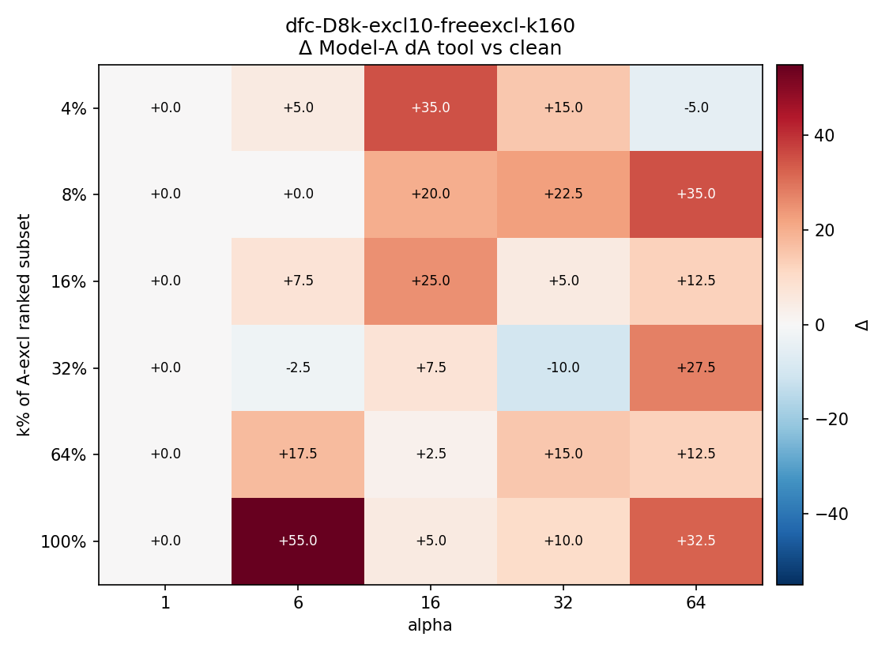

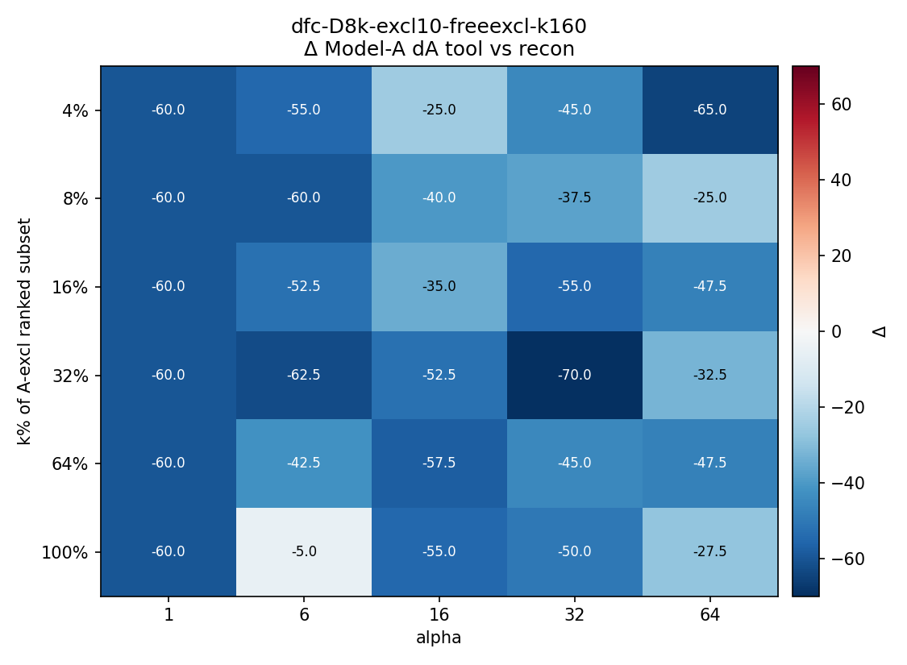

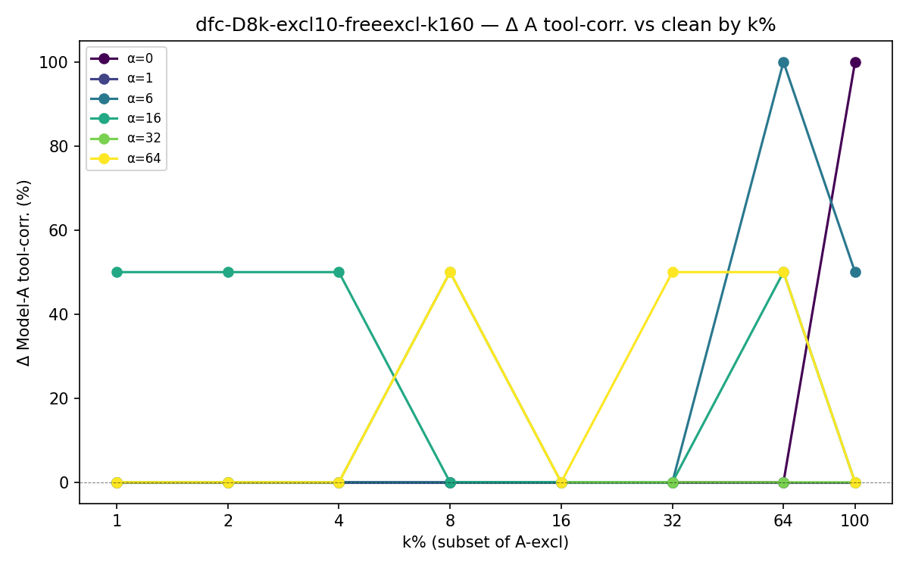

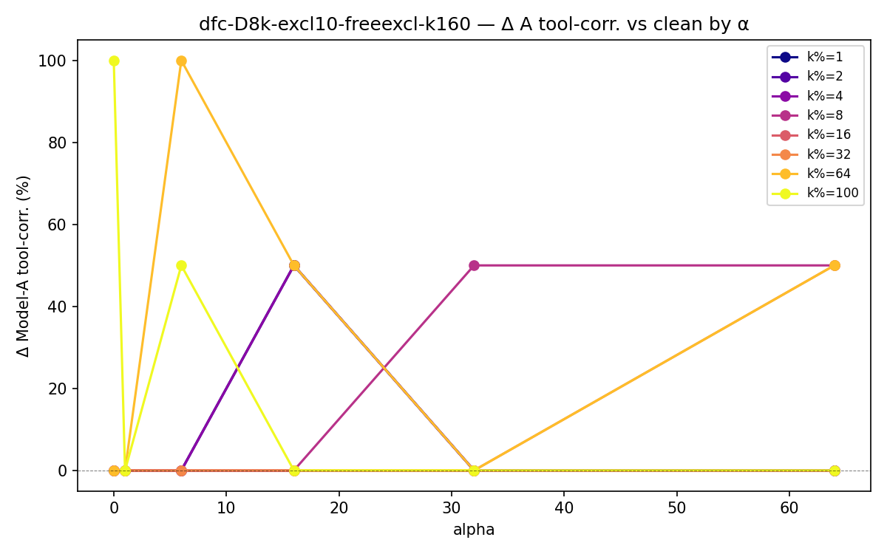

### dfc-D8k-excl10-k45

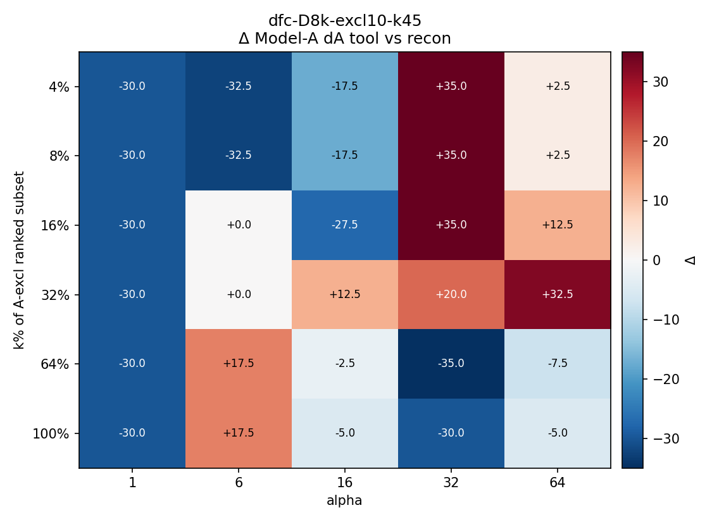

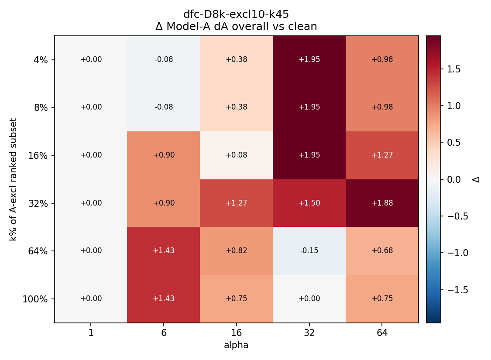

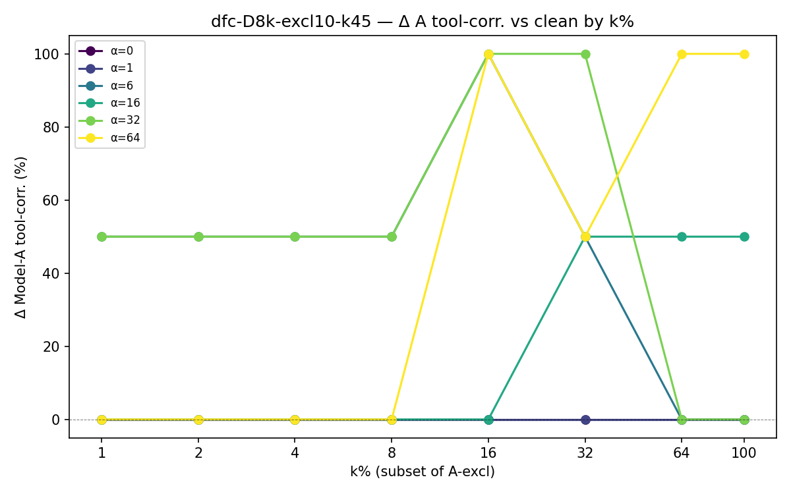

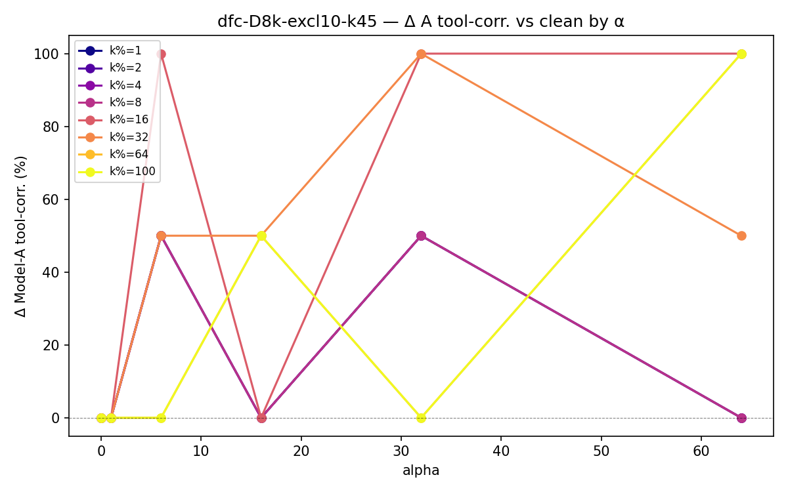

## 4. Decoder geometry (UMAP)

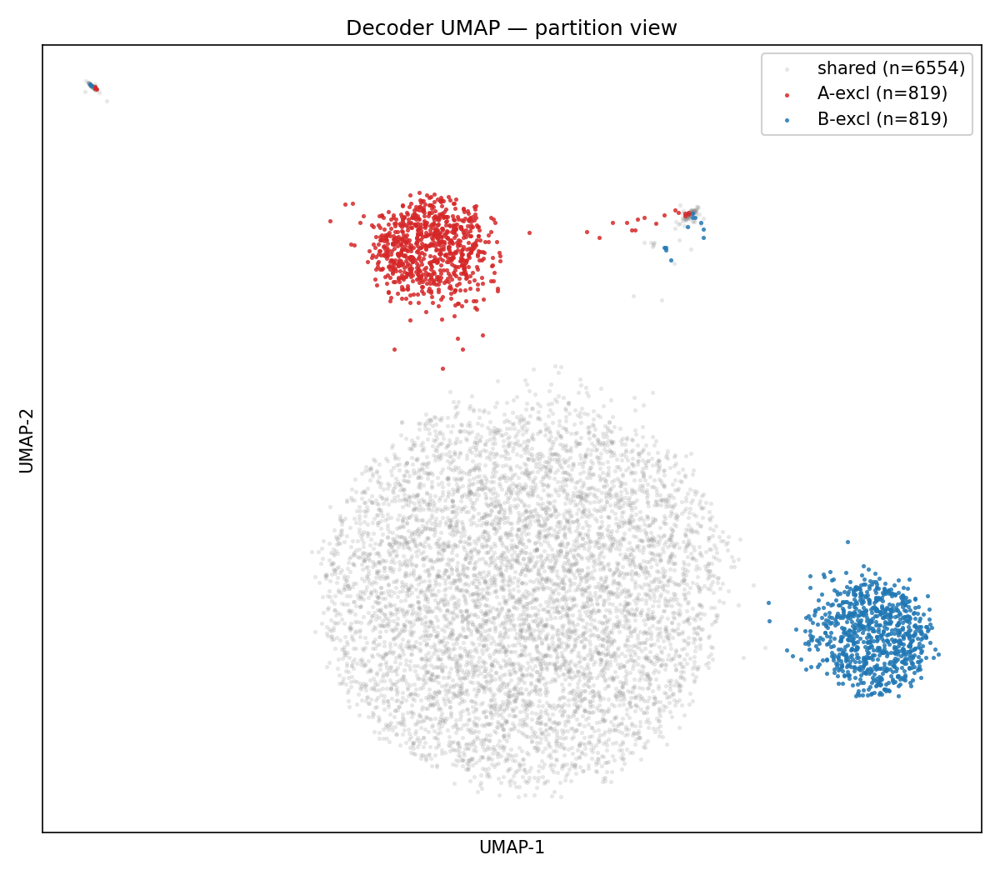

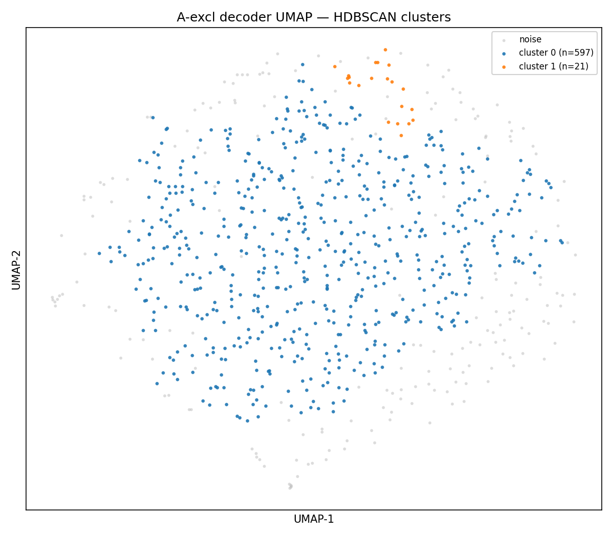

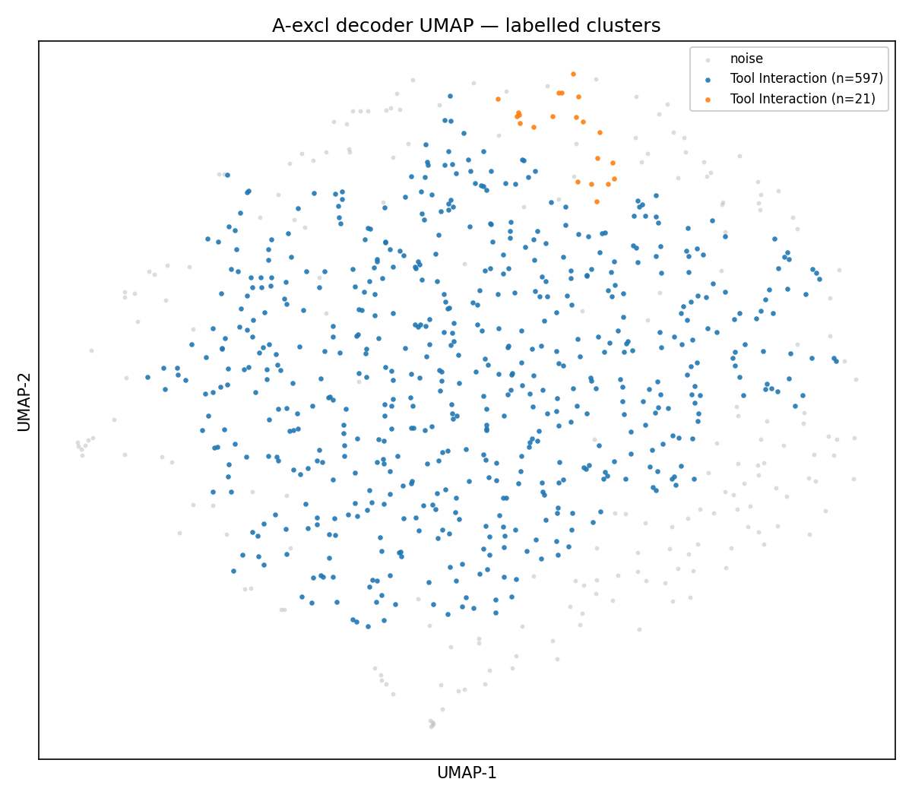

### Cluster names (Gemma meta-autointerp)

| Cluster | Members | Name | Summary |
|--------:|--------:|------|---------|
| 0 | 28 | Tool Interaction | These features describe the interaction between a language model and external tools, including API calls, parameter usage, and structured data exchange. |
| 1 | 2 | Tool Interaction | These features capture aspects of how tools are used and interacted with. |

## 5. A-excl autointerp summary — top 20 (dfc-D8k-excl10-freeexcl-k160)

| feat | cohens_d | auroc | fire_rate_tool | det_score | explanation |
|-----:|---------:|------:|---------------:|----------:|-------------|
| 521 | +12.176 | 0.998 | 1.000 | 0.800 | This feature represents the concept of a language model being instructed to use tools to fulfill user requests. |
| 730 | +4.804 | 0.954 | 1.000 | 0.500 | This feature represents the concept of identifying and retrieving information using unique identifiers. |
| 538 | +4.426 | 0.949 | 1.000 | 0.800 | This feature represents instructions or guidelines related to using tool calls and responses in a system. |
| 126 | +4.118 | 0.929 | 1.000 | 0.750 | This feature represents the concept of referencing or acknowledging previous interactions in a conversation. |
| 636 | +2.363 | 0.826 | 1.000 | 0.550 | This feature represents the concept of a language model interacting with tools and external APIs to perform tasks. |
| 789 | +2.217 | 0.988 | 1.000 | 0.500 | This feature represents requests for information or actions involving technical specifications, APIs, or code. |
| 17 | +2.121 | 0.901 | 1.000 | 0.500 | This feature represents the concept of structured data input and parameters within a dialogue system. |
| 583 | +1.923 | 0.882 | 1.000 | 0.700 | This feature represents the structure and syntax of tool calls within a dialogue system. |
| 786 | +1.658 | 0.892 | 1.000 | 0.700 | This feature represents requests for information or actions that require external tools or knowledge bases. |
| 253 | +1.139 | 0.684 | 1.000 | 0.500 | This feature represents the concept of referencing or accessing information from a previous turn or dialogue history. |
| 10 | +0.896 | 0.635 | 1.000 | 0.900 | This feature represents the concept of a dialogue system interacting with tools and referencing past interactions. |
| 708 | +0.844 | 0.588 | 1.000 | 0.800 | This feature represents the concept of using a tool with specific parameters to perform a task. |
| 128 | +0.695 | 0.577 | 1.000 | 0.450 | This feature represents the description of a tool or its availability within a dialogue system. |
| 546 | +0.472 | 0.552 | 1.000 | 0.600 | This feature represents the structure and syntax of tool calls within a text context. |
| 243 | +0.382 | 0.523 | 1.000 | 0.500 | This feature represents instructions or guidelines for an AI assistant, particularly focusing on tool usage and appropriate response generation. |
| 550 | +0.134 | 0.521 | 0.715 | 0.500 | This feature represents the structure and syntax of API parameter definitions. |
| 173 | +0.077 | 0.508 | 0.024 | 0.800 | This feature is activated by requests for information from previous turns in a conversation or requests to access stored data. |

## 6. Discussion

- H1 (steering improvement) — see best-cell numbers above. Compare against the paper's Δ_A ≈ +30 pp post-recon mean (`results/results_full (1).jsonl`).
- H2 (non-monotone in k%) — inspect `lineplot_*_dA_vs_kpct.png` per model.
- H3 (cluster interpretability) — see Section 4 cluster table.

## 7. Open questions

RL hesitation / stubbornness probe design lives in `docs/rl_boundaries.md` (no code yet).
