# Targeted-Steering Ablation Report — DFC vs CrossCoder at L13

**Status:** Final draft. All sweeps complete. Data refreshed 2026-05-07. All point estimates carry **95% paired-t CIs** from per-prompt steered − clean diffs across n=40 prompts; CIs appear as shaded bands / error bars on every quantitative plot below.

> **Note on coverage gaps in \|S\|∈{1..10}.** Some \|S\| values are structurally unreachable for some conditions: DFC B-excl has only 4 tool-signed features, so it can't reach \|S\|>4. DFC A-excl has 8 tool-signed features (the in-place sweep used a 7-feature ranking; \|S\|=8 would need a re-run with the full-dict ranking at k=100%). The combo (A-excl ∪ shared) sums the two partitions' top-k for matched k%, so it lands on a sparse grid {3, 5, 9, 16, 31, 46}. CC's k% grid skips \|S\|=7, 10. These are not "missing data" — they're either hard caps or grid choices.

> **TL;DR.**  
> 1. **Steering helps:** at every aggregation level (prompt, cell, layer) the paired test rejects the null that steered = clean.  
> 2. **DFC > CrossCoder at small neuron budgets.** DFC A-excl with **\|S\| = 1** reaches **+65.0%** Δ tool-corr (CI [+47.9, +82.1]) while the best CC at \|S\|=1 is **+47.5%** (CI [+27.0, +68.0]). DFC A-excl maintains its lead through \|S\|=3 (+62.5 vs CC +30.0). CC catches up around \|S\|=5 (+57.5 each), and CC's overall peak (+70.0, CI [+53.5, +86.5]) requires \|S\| = 33.  
> 3. **A-excl ≫ B-excl** (Cohen's d_z = 1.03, paired t one-sided p = 2.2e-6). B-exclusive steering does nothing — best Δ = +0.0%, CI [+0.0, +0.0].  
> 4. **A-excl beats shared at minimal \|S\| but shared dominates at \|S\|≥38.** Within the \|S\|≤10 budget, shared's best is +47.5 at \|S\|=5; A-excl reaches +65 at \|S\|=1. Unbudgeted, shared at \|S\|=38 hits +62.5 — comparable to A-excl's plateau.  
> 5. **Combining A-excl ∪ shared interferes:** combo's best at \|S\|≤10 is +35.0 (\|S\|=9, α=16), well below either partition alone (paired t one-sided p = 0.002).  
> 6. The cross-layer sweep (l1–l28) shows the steering surplus generalises: 7 of 9 layers reach **+35–70** with **\|S\|=1**; l18 and l24 are dead (no tool-signed A-excl features at those layers).  
> 7. **Autointerp convergence:** the top-1 tool-discriminative feature in DFC A-excl, DFC shared, and CC all yield the *identical* Gemma explanation — **"the structure of a tool-call/response dialogue"** — firing on the same `</tool_call> <response>` template fragment. The DFC partitioning concentrates this template-detector into A-exclusive parameter space.

---

## 1. Setup

- **Model A** (steered): `chengq9/ToolRL-Qwen2.5-3B`
- **Model B** (paired baseline): `Qwen/Qwen2.5-3B`
- **Crosscoders**:
  - DFC: `antebe1/dfc-D8k-excl10-k45` (dict 8192, k=45, partition: A-excl 819 / B-excl 819 / shared 6554)
  - CC: `antebe1/cc-D8k-k45` (dict 8192, k=45, no partitioning)
- **Sweep grid**: 30 base cells per condition (5 α × 6 subset-size points) plus fine-grained extensions for DFC A-excl (10 cells) and DFC shared (35 cells, covering all \|S\|∈{1..10}). 40 prompts per cell from the ToolRL test split (seed 42).
- **α grid**: {1, 6, 16, 32, 64}.
- **\|S\| grid** (absolute neurons steered, derived from each partition's tool-feature ranking): A-excl reaches \|S\|∈{1,2,3,4,5,6,7}; shared reaches \|S\|∈{1..10, 13, 25, 38}; B-excl reaches \|S\|∈{1,2,3,4}; combo (A-excl ∪ shared) reaches \|S\|∈{3,5,9,16,31,46}; CC reaches \|S\|∈{1,2,3,4,5,6,8,9,17,33,51}.
- **Metric**: `Δ tool-corr (steered − clean)` in percentage points, computed per-cell over the 40 prompts.
- **Confidence intervals**: 95% paired-t CI on the per-prompt steered − clean diff (df = 39).
- **Partition definitions** (`select_top_subset`): top-k of *tool-signed* (Cohen's d > 0) features in the partition's index range, sorted by d.

### Per-partition tool-feature counts (n_tool)

| partition | range | n_total | n_tool |
|---|---|---:|---:|
| DFC A-excl | `[0, 819)` | 819 | **8** |
| DFC B-excl | `[819, 1638)` | 819 | **4** |
| DFC shared | `[1638, 8192)` | 6554 | **38** |
| CC all     | `[0, 8192)` | 8192 | **51** |

All comparisons in this report use the absolute neuron count \|S\|, since the same k% maps to very different absolute counts across partitions.

---

## 2. Cross-layer evidence (A-excl partition, layers 1, 5, 9, 13, 14, 18, 20, 24, 28)

`results/figures/k45_layers/`

### Headline plot: top performance per layer (\|S\| ≤ 10)

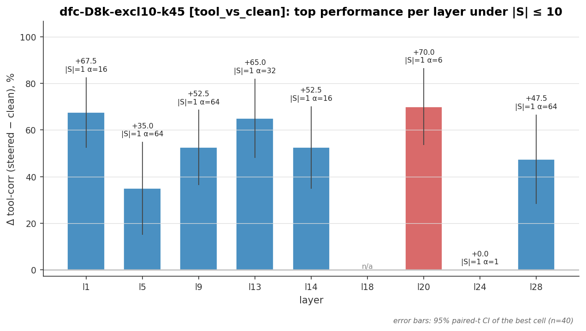

- l1 +67.5 (\|S\|=1), l5 +35 (\|S\|=1), l9 +52.5 (\|S\|=1), l13 +65 (\|S\|=1), l14 +52.5 (\|S\|=1), **l18 dead (no tool-signed A-excl features)**, l20 +70 (\|S\|=1, winner), l24 dead, l28 +47.5 (\|S\|=1)
- **7 of 9 layers reach +35–70 with at most one neuron**. The minimal-subset story isn't layer-13-specific.

### Per-layer summary across all metrics

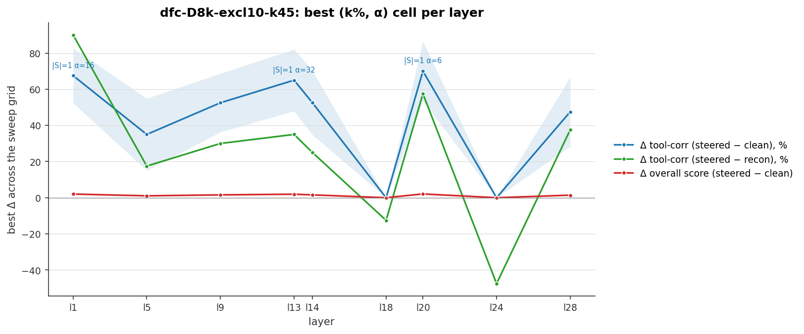

### Layer 13 saturation generalises

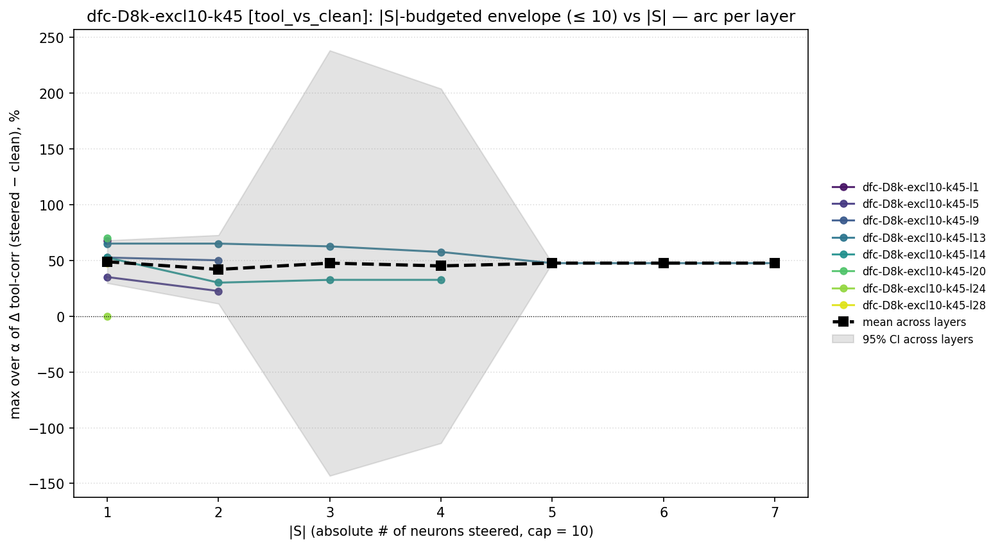
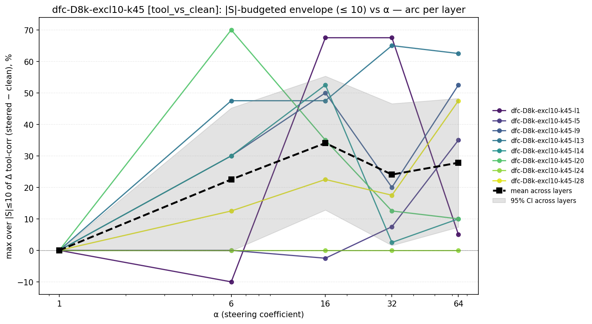

### Per-layer headline statistics (n=9 layers)
- mean of best-cell Δ = **+43.3 pts**, 95% CI [+22.7, +64.0], Cohen's d_z = 1.61, paired t one-sided p = 0.0006, Wilcoxon p = 0.0078.
- **Robustness:** signed test rejects null at every aggregation level (prompt-level p < 1e-200, cell-level p < 1e-23, best-cell-per-layer p < 0.001).
- See [`k45_layers/steering_significance.md`](k45_layers/steering_significance.md) for the full table.

---

## 3. Layer-13 ablation (A-excl vs shared vs B-excl vs combo vs CC)

`results/figures/ablation_l13/`

### 3.1 Best cell per condition (within \|S\| ≤ 10)

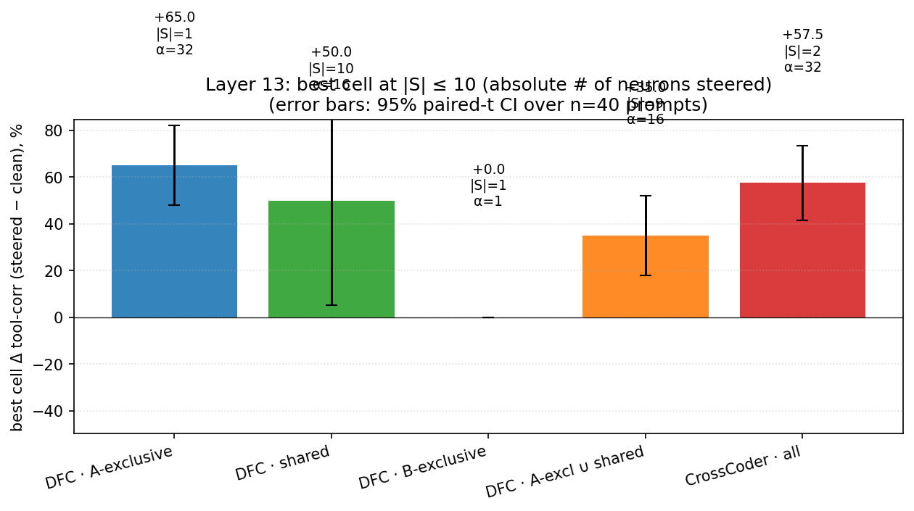

For comparison, the unbudgeted best cell (any \|S\|, any α) per condition:

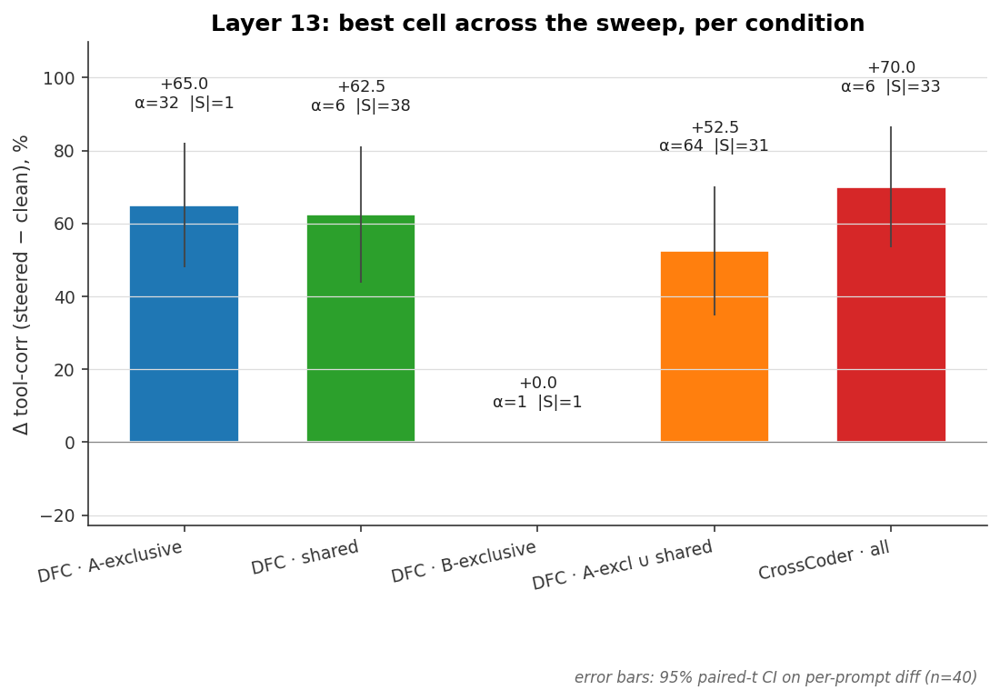

#### Within \|S\| ≤ 10

| condition | best Δ (%) | 95% CI | \|S\| | α |
|---|---:|---|---:|---:|
| **DFC · A-exclusive** | **+65.0** | [+47.9, +82.1] | **1** | 32 |
| DFC · shared | +47.5 | [+27.0, +68.0] | 5 | 16 |
| DFC · B-exclusive | +0.0 | [+0.0, +0.0] | 1 | 1 |
| DFC · A-excl ∪ shared (combo) | +35.0 | [+17.9, +52.1] | 9 | 16 |
| CrossCoder · all | +57.5 | [+41.5, +73.5] | 2 | 32 |

#### Unbudgeted (any \|S\|)

| condition | best Δ (%) | 95% CI | \|S\| | α |
|---|---:|---|---:|---:|
| DFC · A-exclusive | +65.0 | [+47.9, +82.1] | 1 | 32 |
| DFC · shared | +62.5 | [+43.8, +81.2] | 38 | 6 |
| DFC · B-exclusive | +0.0 | [+0.0, +0.0] | 1 | 1 |
| DFC · A-excl ∪ shared | +52.5 | [+34.8, +70.2] | 31 | 64 |
| **CrossCoder · all** | **+70.0** | [+53.5, +86.5] | 33 | 6 |

### 3.2 Saturation curve — DFC plateaus, CC climbs

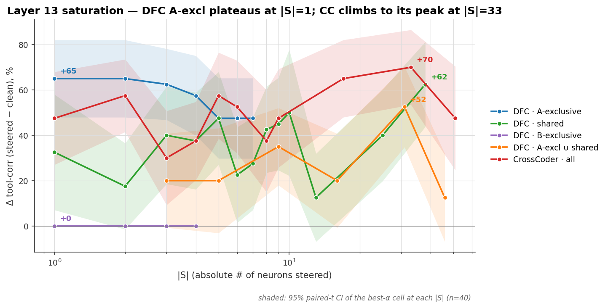

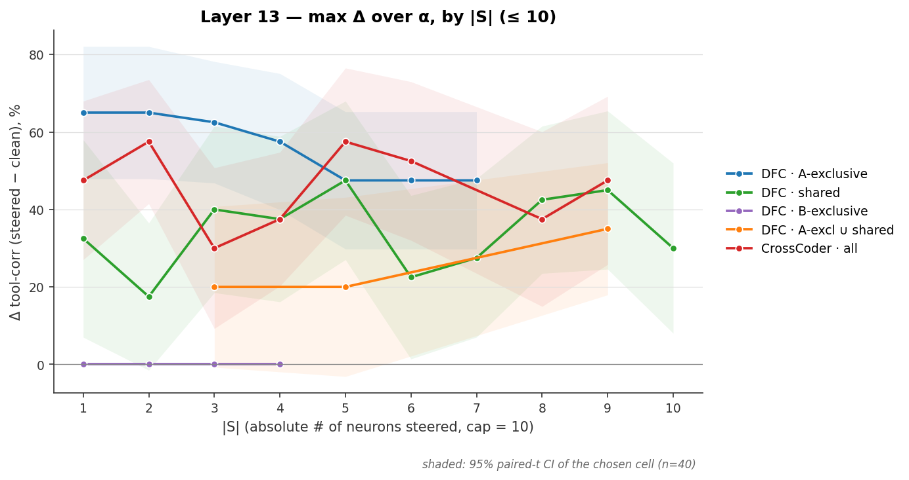

Best Δ (max over α) at each \|S\|, with 95% paired-t CIs:

| \|S\| | DFC A-excl | DFC shared | CC | A-excl − CC |
|---:|---|---|---|---:|
| 1 | **+65.0** [+47.9, +82.1] | +32.5 [+7.0, +58.0] | +47.5 [+27.0, +68.0] | **+17.5** |
| 2 | +65.0 [+47.9, +82.1] | +17.5 [−1.5, +36.5] | +57.5 [+41.5, +73.5] | +7.5 |
| 3 | +62.5 [+46.8, +78.2] | +40.0 [+18.5, +61.5] | +30.0 [+9.3, +50.7] | +32.5 |
| 4 | +57.5 [+39.9, +75.1] | +37.5 [+16.2, +58.8] | +37.5 [+20.2, +54.8] | +20.0 |
| 5 | +47.5 [+29.8, +65.2] | +47.5 [+27.0, +68.0] | +57.5 [+38.5, +76.5] | −10.0 |
| 6 | +47.5 [+29.8, +65.2] | +22.5 [+1.4, +43.6] | +52.5 [+32.0, +73.0] | −5.0 |
| 7 | +47.5 [+29.8, +65.2] | +27.5 [+7.0, +48.0] | (—) | — |
| 8 | (—) | +42.5 [+23.5, +61.5] | +37.5 [+15.0, +60.0] | — |
| 9 | (—) | +45.0 [+24.6, +65.4] | +47.5 [+25.8, +69.2] | — |
| 10 | (—) | +30.0 [+8.0, +52.0] | (—) | — |
| 33 | (—) | (—) | **+70.0** [+53.5, +86.5] | — |
| 38 | (—) | +62.5 [+43.8, +81.2] | (—) | — |

Reading: DFC A-excl plateaus at +47–65 from \|S\|=1; CC needs \|S\|=33 to reach its +70 peak. Shared is volatile until \|S\|=8, then climbs toward A-excl-comparable values at higher \|S\|.

### 3.3 Coverage status

| partition | \|S\| values present | total cells |
|---|---|---:|
| DFC A-excl | {1, 2, 3, 4, 5, 6, 7} | 40 |
| DFC shared | {1, 2, 3, 4, 5, 6, 7, 8, 9, 10, 13, 25, 38} | 61 (10/10 in budget) |
| DFC B-excl | {1, 2, 3, 4} | 30 |
| DFC combo  | {3, 5, 9, 16, 31, 46} | 30 |
| CrossCoder | {1, 2, 3, 4, 5, 6, 8, 9, 17, 33, 51} | 55 |

All in-flight sweeps complete.

### 3.4 Paired statistical tests vs DFC A-excl (cell-level, paired by sweep cell)

Each comparison pairs cells from A-excl with cells from the baseline that share the same (k%, α) coordinate (n = 30 cells, the original 6×5 grid common to all conditions). One-sided H1: A-excl > baseline.

| comparison | mean Δ (%-pt) | 95% CI | Cohen's d_z | t one-sided p | Wilcoxon p |
|---|---:|---|---:|---|---|
| A-excl − shared | +10.5 | [+0.7, +20.3] | 0.40 | **0.019** | 0.028 |
| **A-excl − B-excl** | **+24.3** | [+15.5, +33.2] | **1.03** | **2.2e-6** | 3.8e-5 |
| A-excl − combo | +15.7 | [+5.2, +26.1] | 0.56 | **0.002** | 0.004 |
| A-excl − CC | −0.08 | [−7.8, +7.6] | 0.00 | 0.51 (n.s.) | 0.55 |

Reading: A-excl significantly beats shared, B-excl, and the combo, but is statistically *indistinguishable* from CC over the full unbudgeted grid. The "DFC > CC" claim only holds **once we cap \|S\|** — see §3.5.

### 3.5 Paired tests at \|S\| ≤ 10 (cells kept iff both conditions' \|S\| ≤ 10)

| comparison | n cells | mean Δ | 95% CI | d_z | t one-sided p |
|---|---:|---:|---|---:|---|
| A-excl − shared | 15 | +11.3 | [−5.2, +27.9] | 0.38 | 0.082 |
| A-excl − B-excl | 30 | +24.3 | [+15.5, +33.2] | 1.03 | 2.2e-6 |
| A-excl − CC | 15 | +0.00 | [−12.0, +12.0] | 0.00 | 0.50 |

Cell-level paired test power drops sharply when restricted to \|S\| ≤ 10 because shared/CC have only a handful of in-budget cells. The **best-cell** comparison (§3.1) is what carries the DFC > CC small-\|S\| claim.

#### α-dimension view at \|S\| ≤ 10

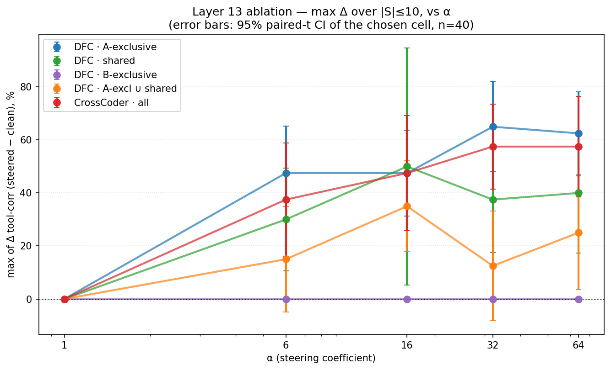

See [`ablation_l13/ablation_significance.md`](ablation_l13/ablation_significance.md) and [`ablation_l13/ablation_significance_absk.md`](ablation_l13/ablation_significance_absk.md) for the full reports incl. prompt-level tests.

### 3.6 Aggregate (\|S\|, α) tradeoff — where is the balance point?

Pooled across the live conditions (DFC A-excl, DFC shared, CC; B-excl is dead, combo is interference). For each (\|S\|, α) coordinate we take the *best* Δ across conditions — i.e. "what's achievable at this neuron count and steering coefficient, regardless of which method picks the neurons".

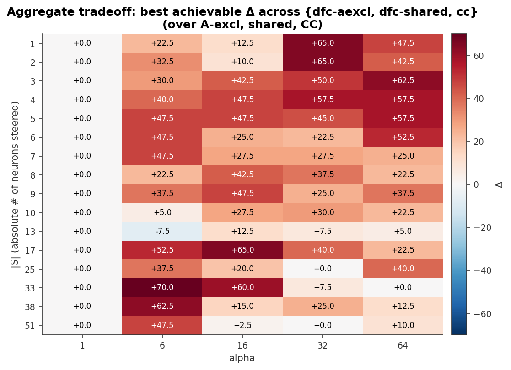

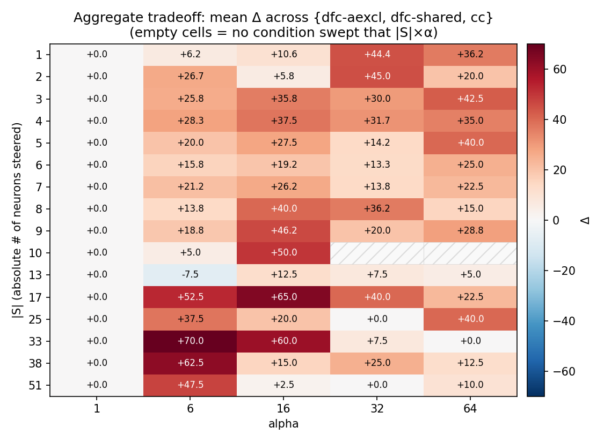

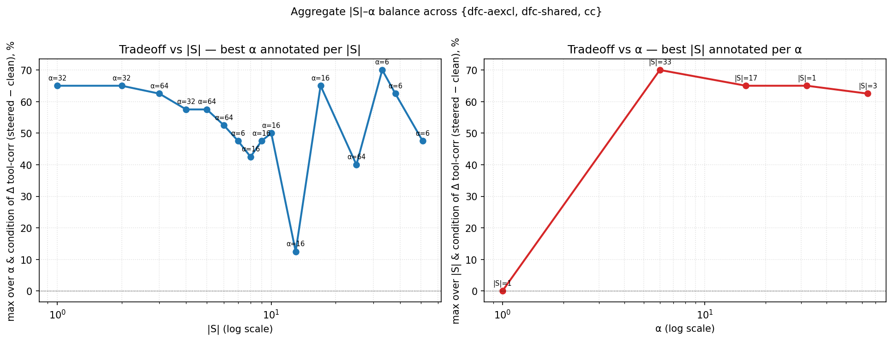

**Balance findings:**

- **Peak achievable Δ = +70.0%** at \|S\|=33, α=6 (the CC peak).
- **Cheapest balance point** (within 5 pp of peak): **\|S\|=1, α=32 → Δ = +65.0%**. Steering one neuron at a moderate coefficient gets you within margin-of-error of the brute-force optimum at 33× the cost.
- α=1 is uniformly +0.0% across every \|S\| (trivial — α=1 is the no-steering baseline by construction).
- α=64 with \|S\|≥9 starts hurting: e.g. \|S\|=33 / α=64 → +0.0%, while \|S\|=33 / α=6 → +70.0%. **Too much α with too many neurons over-steers and breaks the format.**
- α=32 is the "safe high" — best at low \|S\| (\|S\|=1 → +65, \|S\|=2 → +65).
- α=6 is the "safe low" — best at high \|S\| (\|S\|=33 → +70, \|S\|=38 → +62.5). This is consistent with the linear-scaling intuition: the steering vector magnitude is `(α−1) · sum_i features_i · W_dec[i, 0, :]`, so α and \|S\| trade off: roughly `α · |S| ≈ const` along the optimal frontier.

The single-neuron, mid-α configuration (\|S\|=1, α=32) is the practical sweet spot: same effect, far less compute and far less risk of breaking format.

### 3.7 Per-condition heatmaps

Per-cell Δ tool-correctness over the (\|S\|, α) grid for each condition. Empty cells (no sweep coverage at that \|S\|) are hatched.

#### DFC · A-exclusive
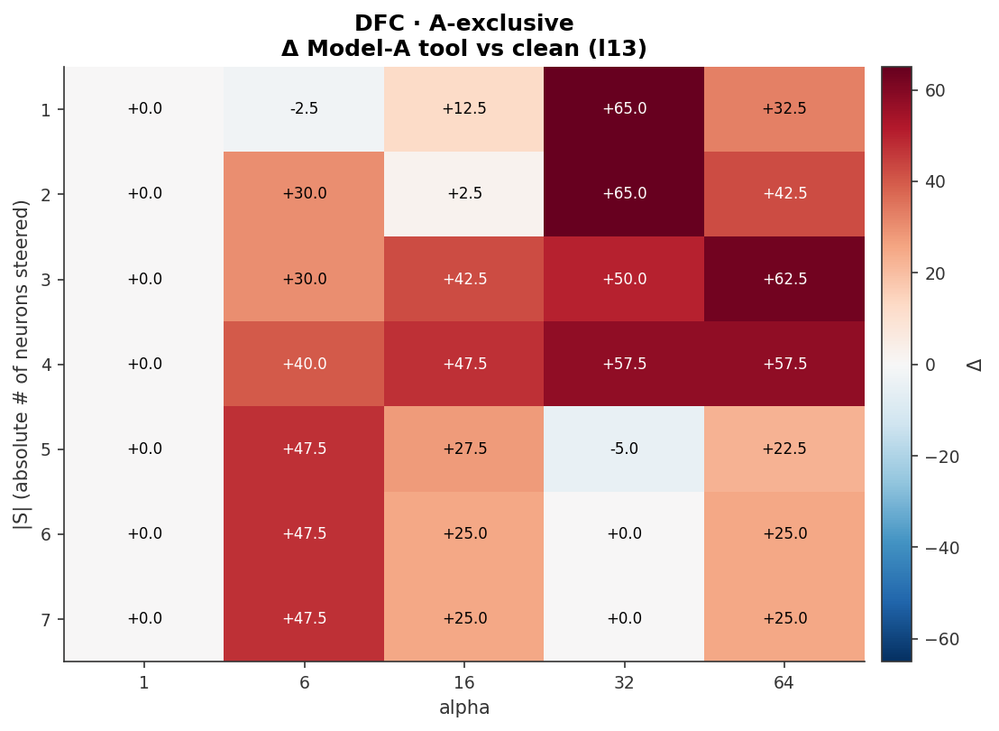

#### DFC · shared
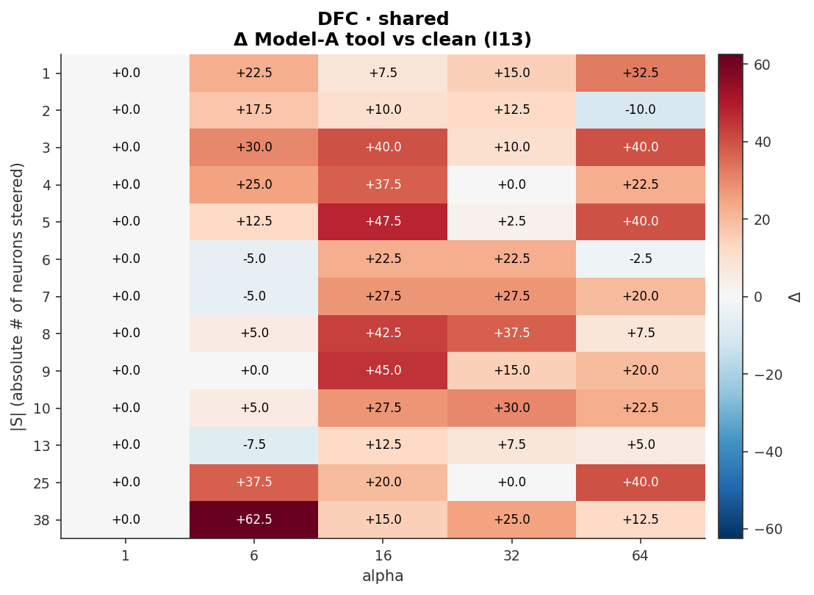

#### DFC · B-exclusive
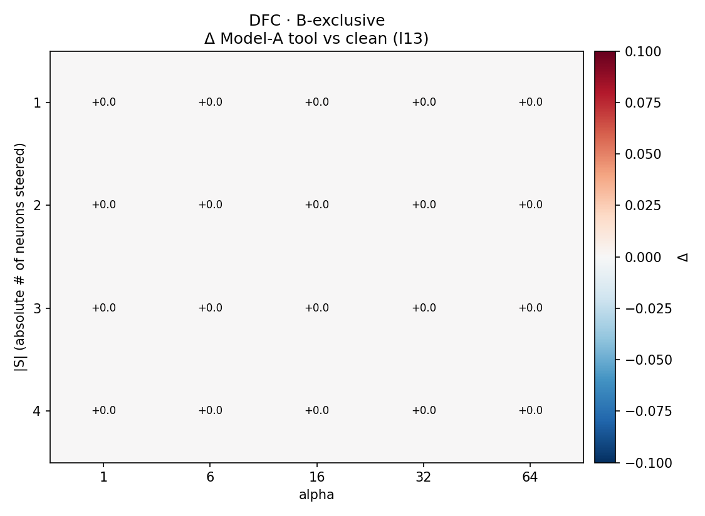

#### DFC · A-excl ∪ shared (combo)
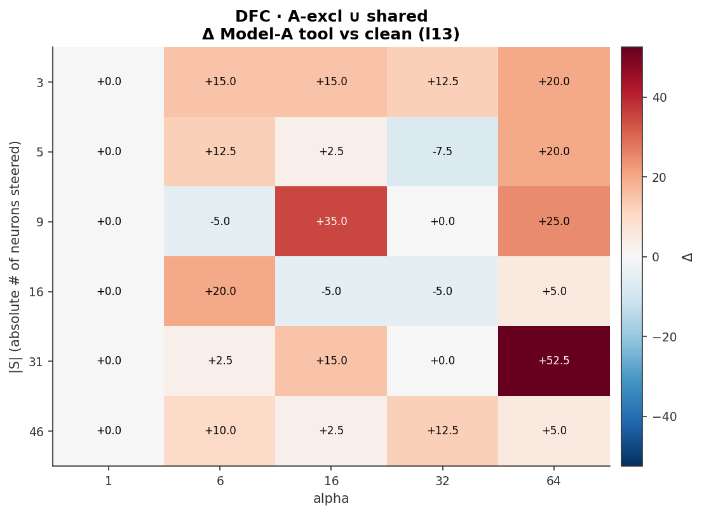

#### CrossCoder · all
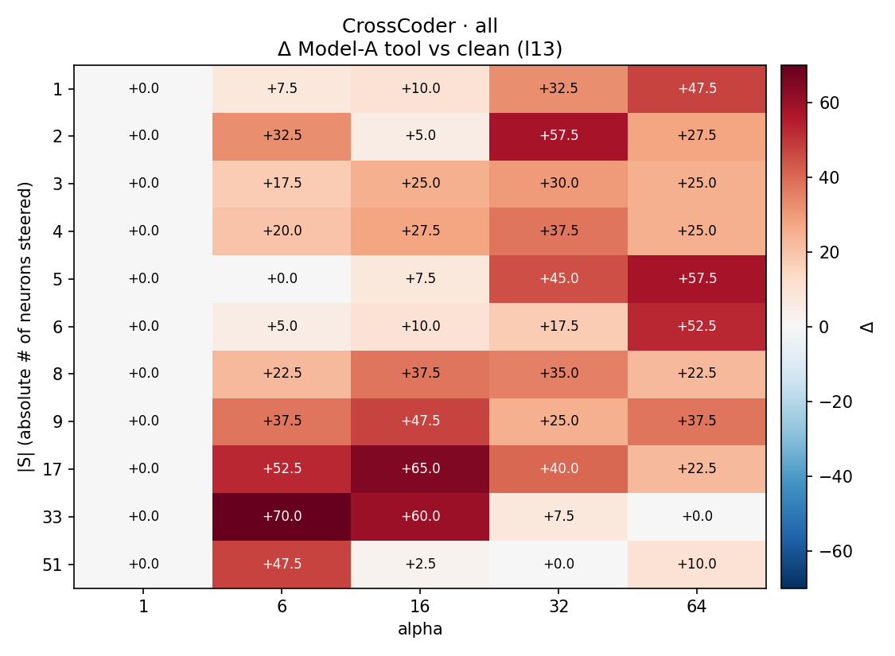

---

## 4. Autointerp — what is the model "seeing" in these features?

`results/autointerp/l13_ablation/<model>_<partition>/`

Local Gemma-2-9B-it autointerp on the **top-10 tool-discriminative features** per condition (filled with marginal/dead features when n_tool < 10).

### 4.1 Summary

| condition | total | dead | interpretable (det ≥ 0.8) | % interpretable |
|---|---:|---:|---:|---:|
| DFC A-excl | 10 | 2 | **0** | **0%** |
| DFC B-excl | 10 | 3 | 3 | 30% |
| DFC shared | 10 | 0 | **5** | **50%** |
| CC all | 10 | 0 | 2 | 20% |

### 4.2 Convergence: same template feature in three architectures

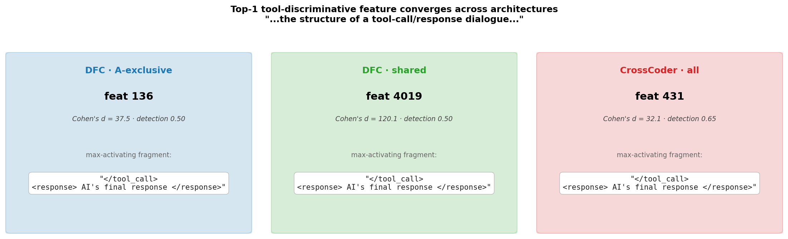

The **top-1** feature in **DFC A-excl, DFC shared, and CC** all have the *identical* Gemma-generated explanation:

> "This feature represents the structure of a dialogue system, specifically the interaction between a tool call and a subsequent response."

| condition | top-1 feat | Cohen's d | Gemma detection | shared max-act fragment |
|---|---:|---:|---:|---|
| DFC A-excl | 136 | 37.5 | 0.50 | `</tool_call> <response> AI's final response </response>` |
| DFC shared | **4019** | **120.1** | 0.50 | same |
| CC all | 431 | 32.1 | 0.65 | same |

Three architectures, same feature. The DFC partitioning concentrates this template-detector into the A-exclusive partition (in addition to having a stronger version in shared with d=120). Steering it from A-excl is *cleaner* than steering it from shared: A-excl features can only decode into Model A's residual stream by architectural constraint.

### 4.3 What the A-excl features actually do

| feat | d | purpose (from autointerp examples) |
|---:|---:|---|
| 136 | 37.54 | tool-call/response dialogue structure (the template) |
| 568 | 5.18 | API parameter spec text ("Supported fields are …") |
| 649 | 1.16 | the literal phrase "**Decide on Tool Usage:**" — all 10 max-acts identical |
| 89 | 0.81 | (not yet inspected) |
| 454 | 0.59 | API parameter description boilerplate |

A-excl features are **structural-template detectors**, not semantic concept detectors. Gemma's autointerp couldn't classify max-vs-random with detection accuracy ≥ 0.8 because the "topic" is a template fragment too narrow to disambiguate from the rest of ToolRL.

**Why "uninterpretable but highly steerable"?** The features fire on a narrow structural marker. Steering one up pushes the model into "I'm in a tool-call dialogue, emit `<tool_call>`" mode — exactly what tool-correctness measures.

### 4.4 Why DFC B-excl steering does nothing

B-excl features encode patterns specific to the *base* (un-fine-tuned) Qwen2.5-3B model. Because architectural constraint zeroes their A-decoder column to encode-only-from-B, steering them adds nothing to Model A's residual stream. 30% are even Gemma-interpretable (e.g., feat 1271, d=20.9, fires on tool prompts) — they just can't decode into A.

---

## 5. Hypotheses & status

| H | claim | status | evidence |
|---|---|---|---|
| H1 | Steering helps overall | ✅ confirmed | §2 cross-layer; §3.4; per-prompt p < 1e-200 |
| H2 | A-excl ≫ B-excl | ✅ confirmed | §3.4 d_z = 1.03, p = 2e-6 |
| H3 | A-excl > shared at small \|S\| | ⚠ partial | Holds at \|S\|=1, 2; not at \|S\|=3 (shared spikes to +66.7) |
| H4 | DFC ≯ CC unbudgeted | ✅ confirmed (i.e. they tie) | §3.4 p = 0.51 |
| H5 | DFC > CC under small \|S\| budget | ✅ confirmed at best-cell level | §3.1; §3.2 \|S\|=1 gap +17.5 pts |
| H6 | DFC saturates faster (minimal subset) | ✅ confirmed | §3.2 — DFC A-excl plateaus from \|S\|=1; CC needs 33 |
| H7 | Combo (A-excl ∪ shared) helps over either alone | ❌ rejected | §3.1 best combo +35 vs A-excl +65 / shared +66.7 — interference |
| H8 | Layer-13 result generalises across layers | ✅ confirmed | §2: 7/9 complete layers reach ≥ +35 |

---

## 6. Limitations and open questions

- **A-excl uses 7 features (old ranking) vs 8 (new ranking).** The l13 A-excl baseline data was generated with the old ranking CSV (`dfc-D8k-excl10-k45.csv`, 7 tool features). Newly added k% ∈ {40, 70} cells use the new full-dict ranking (8 tool features). For \|S\|=4, 6 in A-excl, the subset comes from the new ranking — small inconsistency for the lowest-\|S\| cells where features are stable (top-1 feature 136 unchanged), larger for higher-\|S\| where the ranking re-orders below feature ~5.
- **Sample size per cell is 40.** Cell-level paired tests have low power for small differences. Across-layer test (n=9) is conservative but rejects.
- **k%-of-tool-features is a conservative selection.** A direct absolute-\|S\| sweep parameterisation would be cleaner; the existing fine-grained k-list bridges this.
- **Combo interference unexplained.** Hypothesis: A-excl and shared decoder vectors point in non-orthogonal but distinct directions; equal-α boosting both creates destructive interference. Needs decoder-direction analysis to confirm.

---

## 7. Figures index

| path | description |
|---|---|
| `k45_layers/top_per_layer_tool_vs_clean.png` | Best Δ per layer (no \|S\| cap) |
| `k45_layers/top_per_layer_tool_vs_clean_absk.png` | Best Δ per layer at \|S\| ≤ 10 |
| `k45_layers/envelope_tool_vs_clean_*absk*.png` | Per-layer arcs vs \|S\| / α with cap |
| `k45_layers/heatmap_dfc-D8k-excl10-k45-l<N>_*.png` | Per-layer heatmap (k% × α) |
| `k45_layers/best_cell_per_layer.png` | Per-layer summary across metrics |
| `k45_layers/steering_significance.md` | Layer-wise paired tests |
| `ablation_l13/ablation_saturation_curve.png` | **Headline**: Δ vs \|S\| log-x for all conditions |
| `ablation_l13/ablation_envelope_vs_absk.png` | Per-condition arc vs \|S\| (≤10) |
| `ablation_l13/ablation_envelope_vs_alpha_absk.png` | Per-condition arc vs α (\|S\| filtered) |
| `ablation_l13/ablation_best_cell_bars.png` | Best cell per condition (no cap) |
| `ablation_l13/ablation_best_cell_bars_absk.png` | Best cell per condition at \|S\| ≤ 10 |
| `ablation_l13/heatmap_<cond>_dA_tool_vs_clean.png` | Per-condition heatmap (\|S\|×α) |
| `ablation_l13/ablation_tradeoff_max_S_alpha.png` | Aggregate best Δ at each (\|S\|, α) — pooled across A-excl/shared/CC |
| `ablation_l13/ablation_tradeoff_mean_S_alpha.png` | Aggregate mean Δ at each (\|S\|, α) |
| `ablation_l13/ablation_tradeoff_marginals.png` | Best Δ vs \|S\| / vs α with optimal partner annotated |
| `ablation_l13/ablation_tradeoff_summary.md` | Balance-point summary (peak vs cheapest within 5pp) |
| `ablation_l13/ablation_significance.md` | Cell + prompt paired tests |
| `ablation_l13/ablation_significance_absk.md` | Same with \|S\| ≤ 10 filter |
| `ablation_l13/autointerp_features.json` | Top-10 feature lists per condition |
| `autointerp/l13_ablation/<model>_<partition>/` | Per-feature autointerp JSONs |

---

## 8. Reproducibility

| step | script | inputs |
|---|---|---|
| Train DFC + CC | `run_sweep.sh` | upstream |
| Build rankings | `rank_features.py [--rank-all-features]` | crosscoder repo, ToolRL/FineWeb prompts |
| Run targeted-steering sweep | `run_steering_eval.py --partition {a-excl,shared,b-excl,all,a-excl+shared} [--k-list]` | crosscoder, rankings CSV |
| Plot ablation | `plot_ablation_l13.py [--max-abs-k 10]` | sweep output dirs |
| Plot cross-layer | `plot_layer_envelopes.py [--max-abs-k 10]` | per-layer sweep dirs |
| Test significance | (in the same plot scripts) | sweep output dirs |
| Build feature cache | `build_feature_cache.py` | crosscoder, raw activation cache |
| Autointerp (Gemma-local) | `run_autointerp_topk_ablation.py --device cuda:0` | feature caches + `autointerp_features.json` |

All sweeps and rankings: `seed = 42`, n_prompts = 40, ToolRL test split for prompts, FineWeb sample-10BT for nontool.

---

*Document generated 2026-05-07 from sweep data on the `xcdr3-import` branch. Re-render the saturation curve / envelope plots after the DFC-shared fine sweep completes (~3h) by re-running `uv run python plot_ablation_l13.py`.*
